--8<-- "snippets/send-bizevent/5-opentelemetry-traces.js"
# OpenTelemetry Traces

In this lab module we'll utilize the OpenTelemetry Collector deployed as a Deployment (Gateway) to collect application traces/spans, generated by OpenTelemetry, from a Kubernetes cluster and ship them to Dynatrace.

**Lab tasks:**

1. Deploy OpenTelemetry Collector as a Deployment
2. Configure OpenTelemetry Collector service pipeline for span enrichment
3. Analyze application reliability via traces in Dynatrace

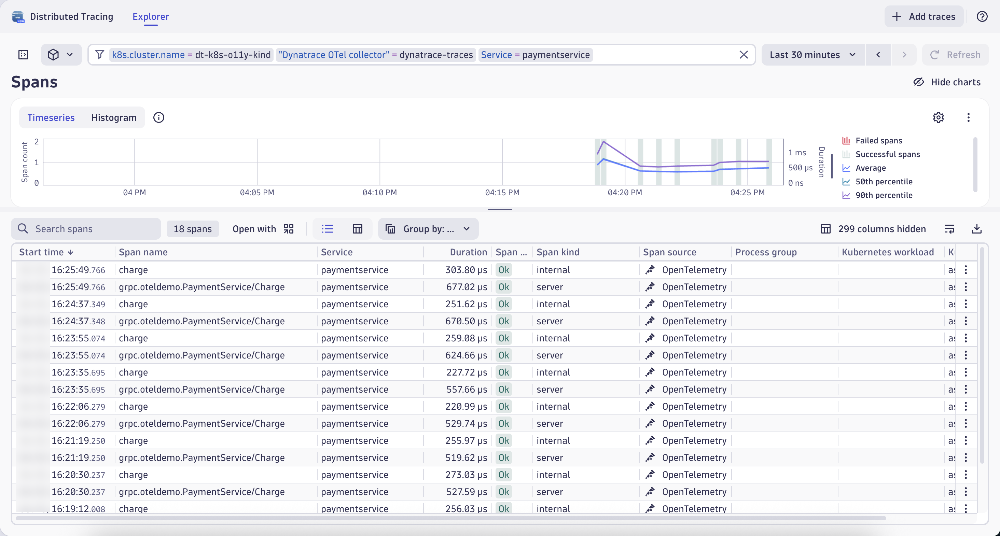
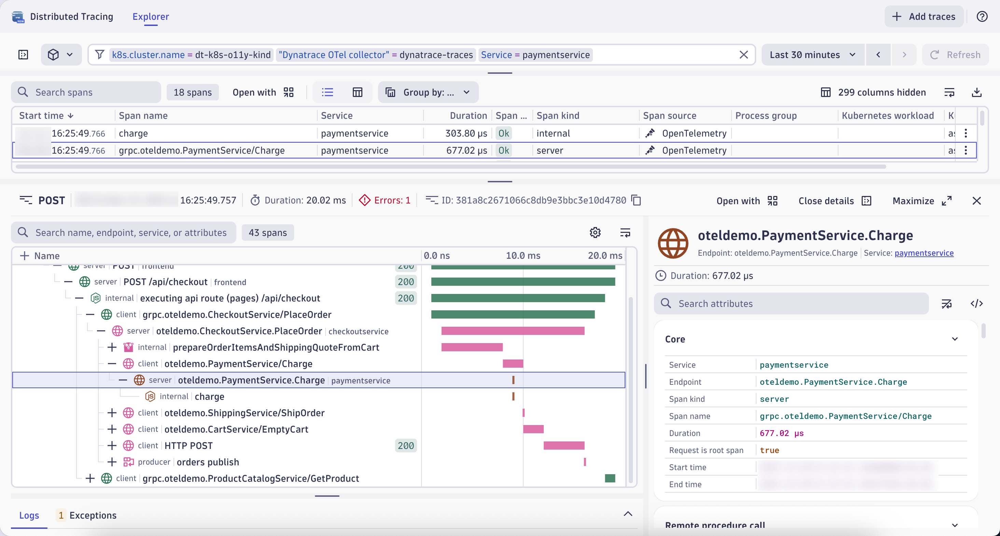

<div class="grid cards" markdown>
- [Learn More:octicons-arrow-right-24:](https://docs.dynatrace.com/docs/ingest-from/opentelemetry){target="_blank"}
</div>

## Prerequisites

**Import Notebook into Dynatrace**

[Notebook](https://github.com/dynatrace-wwse/enablement-kubernetes-opentelemetry/blob/main/assets/dynatrace/notebooks/opentelemetry-traces_dt_notebook.json){target="_blank"}

**Import Dashboard into Dynatrace**

[Dashboard](https://github.com/dynatrace-wwse/enablement-kubernetes-opentelemetry/blob/main/assets/dynatrace/dashboards/opentelemetry-traces_dt_dashboard.json){target="_blank"}

**Define workshop user variables**

In your Github Codespaces Terminal set the environment variables:

!!! tip "Sprint Environment"
    Are you using a Sprint environment for your Dynatrace tenant?  If so, then use `export DT_ENDPOINT=https://{your-environment-id}.sprint.dynatracelabs.com/api/v2/otlp` instead of the `live` version below.

```
export DT_ENDPOINT=https://{your-environment-id}.live.dynatrace.com/api/v2/otlp
export DT_API_TOKEN={your-api-token}
export NAME=<INITIALS>-k8s-otel-o11y
```

**Move into the traces module directory**

Command:
```sh
cd $BASE_DIR/lab-modules/opentelemetry-traces
```

## OpenTelemetry Collector for Traces
[Dynatrace Documentation](https://docs.dynatrace.com/docs/extend-dynatrace/opentelemetry/collector/deployment){target="_blank"}

Distributed traces and their spans, generated by OpenTelemetry agents and SDKs, are exported from their origin to an `otlp` receiver.  These traces/spans can be sent directly to Dynatrace, using the OTLP ingest API.  However, it is highly recommended to use the OpenTelemetry Collector to process, filter, and manipulate the data first.

### `otlp` Receiver
[OpenTelemetry Documentation](https://github.com/open-telemetry/opentelemetry-collector/tree/main/receiver/otlpreceiver){target="_blank"}

Adding the `otlp` receiver allows us to receive telemetry from otel exporters, such as agents and other collectors.

```yaml
config:
    receivers:
      otlp:
        protocols:
          grpc:
            endpoint: 0.0.0.0:4317
          http:
            endpoint: 0.0.0.0:4318
    service:
      pipelines:
        traces:
          receivers: [otlp]
          processors: [batch]
          exporters: [otlphttp/dynatrace]
```

### Deploy OpenTelemetry Collector Deployment
[Dynatrace Documentation](https://docs.dynatrace.com/docs/extend-dynatrace/opentelemetry/collector/deployment#tabgroup--dynatrace-docs--gateway){target="_blank"}

The gateway collector deployment pattern consists of applications (or other collectors) sending telemetry signals to a single OTLP endpoint provided by one or more collector instances running as a standalone service (for example, a deployment in Kubernetes), typically per cluster, per data center or per region.

```yaml
---
apiVersion: opentelemetry.io/v1beta1
kind: OpenTelemetryCollector
metadata:
  name: dynatrace-traces
  namespace: dynatrace
spec:
  envFrom:
  - secretRef:
      name: dynatrace-otelcol-dt-api-credentials
  mode: "deployment"
  image: "ghcr.io/dynatrace/dynatrace-otel-collector/dynatrace-otel-collector:latest"
```
Command:
```sh
kubectl apply -f opentelemetry/collector/traces/otel-collector-traces-crd-01.yaml
```
Sample output:
> opentelemetrycollector.opentelemetry.io/dynatrace-traces created

**Validate running pod(s)**

Command:
```sh
kubectl get pods -n dynatrace
```

Sample output:

| NAME                                       | READY | STATUS  | RESTARTS | AGE |
|--------------------------------------------|-------|---------|----------|-----|
| dynatrace-traces-collector-559d5b9d77-ms24p | 1/1   | Running | 0        | 1m  |

**Export OpenTelemetry data from `astronomy-shop` to OpenTelemetry Collector - Dynatrace Distro**

The `astronomy-shop` demo application has the OpenTelemetry agents and SDKs already instrumented.  These agents and SDKs are generating traces (logs and metrics too) that are being exported to a Collector running within the `astronomy-shop` namespace bundled into the application deployment.  We want these traces to be shipped to Dynatrace as well.

**Customize astronomy-shop helm values**

OpenTelemetry data created by agents and SDKs should include `service.name` and `service.namespace` attributes.  We will make the `service.namespace` unique to our deployment using our `NAME` environment variable declared earlier, using a `sed` command on the Helm chart's `values.yaml` file.

```yaml
default:
  # List of environment variables applied to all components
  env:
    - name: OTEL_SERVICE_NAME
      valueFrom:
        fieldRef:
          apiVersion: v1
          fieldPath: "metadata.labels['app.kubernetes.io/component']"
    - name: OTEL_COLLECTOR_NAME
      value: '{{ include "otel-demo.name" . }}-otelcol'
    - name: OTEL_EXPORTER_OTLP_METRICS_TEMPORALITY_PREFERENCE
      value: cumulative
    - name: OTEL_RESOURCE_ATTRIBUTES
      value: 'service.name=$(OTEL_SERVICE_NAME),service.namespace=NAME_TO_REPLACE,service.version={{ .Chart.AppVersion }}'
```
> service.namespace=NAME_TO_REPLACE\
> service.namespace=INITIALS-k8s-otel-o11y

Command:
```sh
sed "s,NAME_TO_REPLACE,$NAME," astronomy-shop/collector-values.yaml > astronomy-shop/sed/collector-values.yaml
```

**Update `astronomy-shop` OpenTelemetry Collector export endpoint via helm**

Our `collector-values.yaml` contains new configurations for the application so that the `astronomy-shop` Collector includes exporters that ship to the Collectors deployed in the `dynatrace` namespace.

```yaml
exporters:
  # Dynatrace OTel Collectors
  otlphttp/dttraces:
    endpoint: http://dynatrace-traces-collector.dynatrace.svc.cluster.local:4318
  otlphttp/dtlogs:
    endpoint: http://dynatrace-logs-collector.dynatrace.svc.cluster.local:4318
  otlphttp/dtmetrics:
    endpoint: http://dynatrace-metrics-cluster-collector.dynatrace.svc.cluster.local:4318
```

Command:
```sh
helm upgrade astronomy-shop open-telemetry/opentelemetry-demo --values astronomy-shop/sed/collector-values.yaml --namespace astronomy-shop --version "0.31.0"
```
Sample output:
> NAME: astronomy-shop\
> LAST DEPLOYED: Thu Jun 27 20:58:38 2024\
> NAMESPACE: astronomy-shop\
> STATUS: deployed\
> REVISION: 2

### Analyze OpenTelemetry Traces in Dynatrace

Open the **opentelemetry-traces_dt_notebook** Notebook.

**Query spans in Dynatrace**

DQL:

```
fetch spans
| filter isNotNull(service.name) and isNotNull(service.namespace) and isNotNull(otel.scope.name)
| sort start_time desc
| limit 100
| fields start_time, end_time, service.name, service.namespace, trace.id, span.id, duration
```

Result:

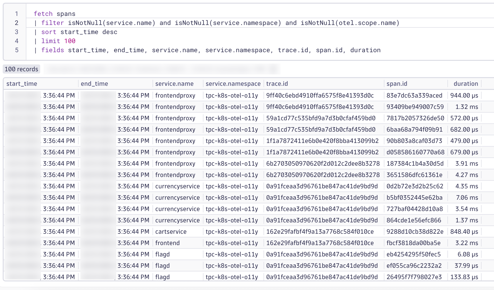

### PaymentService Spans

Now that you've confirmed OpenTelemetry spans are successfully ingested into Dynatrace, it's time to narrow your focus to a specific business-critical function: payment processing. In this next step, you'll refine your DQL query to isolate traces and spans related to the `paymentservice` workload and the `charge` operation. This targeted analysis allows you to observe how Dynatrace captures and contextualizes telemetry data for a key service, helping you validate instrumentation, understand service behavior, and identify potential performance bottlenecks in the payment flow.

**Query spans in Dynatrace**

DQL:

```
fetch spans
| filter isNotNull(service.name) and isNotNull(service.namespace) and isNotNull(otel.scope.name)
| filter matchesValue(service.name,"paymentservice") and matchesValue(endpoint.name,"oteldemo.PaymentService.Charge")
| sort start_time desc
| limit 10
| fields start_time, end_time, service.name, service.namespace, trace.id, span.id, duration, app.payment.amount
```

Result:

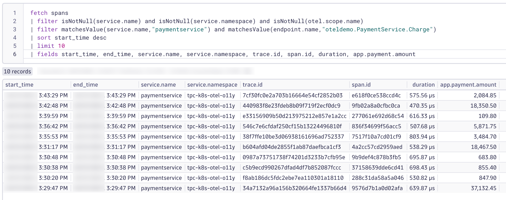

With a filtered view of spans related to the `paymentservice` and its `charge` operation, you're now ready to dive deeper into the behavior of individual traces. Next, you'll select one of the trace IDs from your query results and open it in the **Distributed Tracing** App. This will allow you to explore the full trace waterfall, visualize the end-to-end flow of the payment processing transaction, and analyze how the Charge span fits into the broader service interaction. This hands-on inspection is key to understanding latency contributors, service dependencies, and the overall health of your instrumented application.

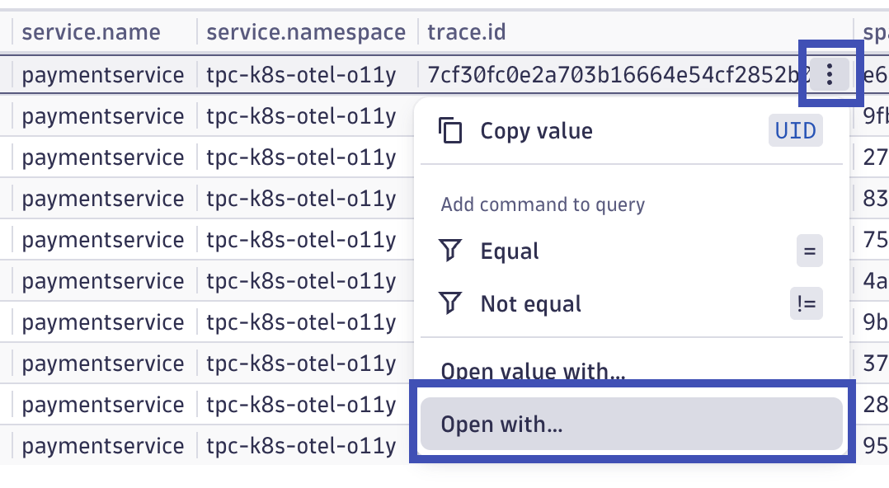
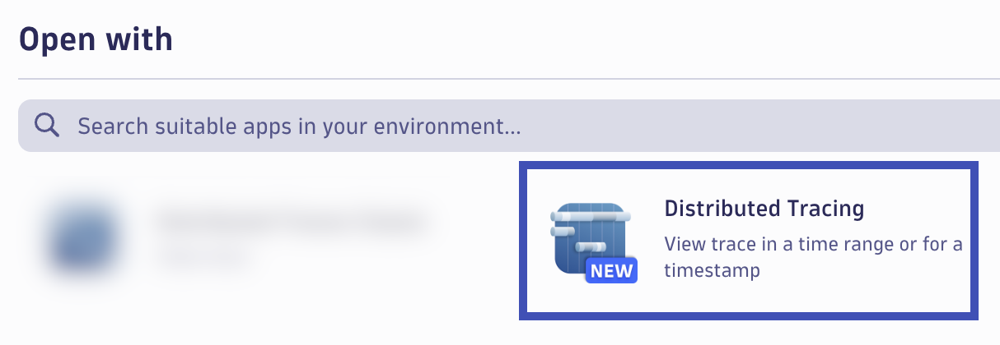

Take some time to analyze the distributed trace containing the `paymentservice` span.  Review the captured metadata, detailed timings, logs, exceptions, and topology context.

[Refer to the Dynatrace documentation for more details](https://docs.dynatrace.com/docs/analyze-explore-automate/distributed-tracing/distributed-tracing-app#single-trace-perspective){target="_blank"}

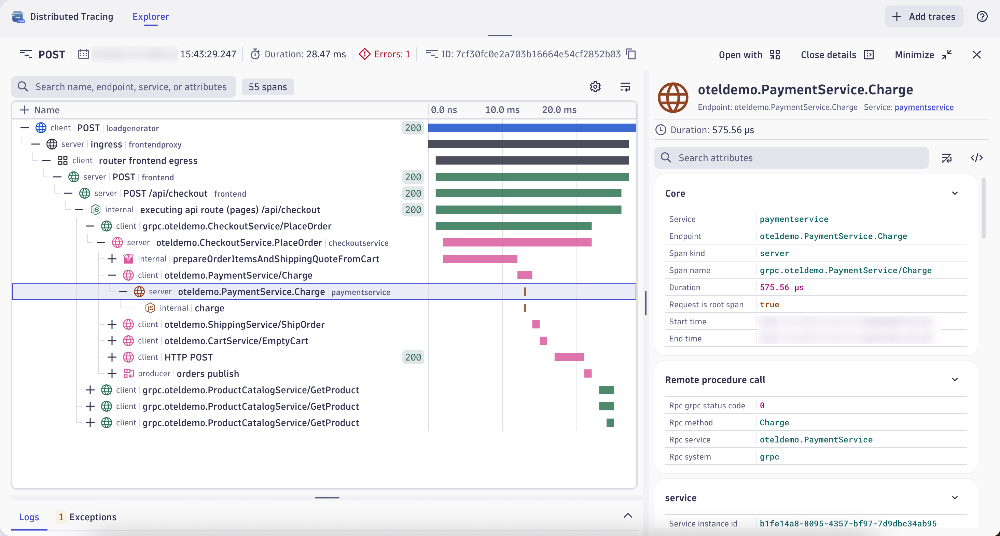

These attributes are good, but we can add more to provide better Kubernetes context to these transactions.

## k8sattributes Processor

**Add Kubernetes Attributes with the `k8sattributes` Processor**

The Kubernetes Attributes Processor automatically discovers Kubernetes pods, extracts their metadata, and adds the extracted metadata to spans, metrics, and logs as resource attributes.

The Kubernetes Attributes Processor is one of the most important components for a collector running in Kubernetes. Any collector receiving application data should use it. Because it adds Kubernetes context to your telemetry, the Kubernetes Attributes Processor lets you correlate your application’s traces, metrics, and logs signals with your Kubernetes telemetry, such as pod metrics and traces.

### Configure Kubernetes RBAC

**Create `clusterrole` with read access to Kubernetes objects**

Since the processor uses the Kubernetes API, it needs the correct permission to work correctly. For most use cases, you should give the service account running the collector the following permissions via a ClusterRole.

```yaml
---
apiVersion: rbac.authorization.k8s.io/v1
kind: ClusterRole
metadata:
  name: otel-collector-k8s-clusterrole-traces
rules:
- apiGroups: [""]
  resources: ["pods", "namespaces", "nodes"]
  verbs: ["get", "watch", "list"]
- apiGroups: ["apps"]
  resources: ["replicasets"]
  verbs: ["get", "list", "watch"]
- apiGroups: ["extensions"]
  resources: ["replicasets"]
  verbs: ["get", "list", "watch"]
```
Command:
```sh
kubectl apply -f opentelemetry/rbac/otel-collector-k8s-clusterrole-traces.yaml
```
Sample output:
> clusterrole.rbac.authorization.k8s.io/otel-collector-k8s-clusterrole-traces created

**Create `clusterrolebinding` for OpenTelemetry Collector service account**

```yaml
---
apiVersion: rbac.authorization.k8s.io/v1
kind: ClusterRoleBinding
metadata:
  name: otel-collector-k8s-clusterrole-traces-crb
subjects:
- kind: ServiceAccount
  name: dynatrace-traces-collector
  namespace: dynatrace
roleRef:
  kind: ClusterRole
  name: otel-collector-k8s-clusterrole-traces
  apiGroup: rbac.authorization.k8s.io
```
Command:
```sh
kubectl apply -f opentelemetry/rbac/otel-collector-k8s-clusterrole-traces-crb.yaml
```
Sample output:
> clusterrolebinding.rbac.authorization.k8s.io/otel-collector-k8s-clusterrole-traces-crb created

### Add `k8sattributes` Processor

[OpenTelemetry Documentation](https://opentelemetry.io/docs/kubernetes/collector/components/#kubernetes-attributes-processor){target="_blank"}

The `k8sattributes` processor will query metadata from the cluster about the k8s objects.  The Collector will then marry this metadata to the telemetry.

```yaml
k8sattributes:
    auth_type: "serviceAccount"
    passthrough: false
        filter:
        node_from_env_var: KUBE_NODE_NAME
    extract:
        metadata:
            - k8s.namespace.name
            - k8s.deployment.name
            - k8s.daemonset.name
            - k8s.job.name
            - k8s.cronjob.name
            - k8s.replicaset.name
            - k8s.statefulset.name
            - k8s.pod.name
            - k8s.pod.uid
            - k8s.node.name
            - k8s.container.name
            - container.id
            - container.image.name
            - container.image.tag
        labels:
        - tag_name: app.label.component
            key: app.kubernetes.io/component
            from: pod
    pod_association:
        - sources:
            - from: resource_attribute
              name: k8s.pod.uid
        - sources:
            - from: resource_attribute
              name: k8s.pod.name
        - sources:
            - from: resource_attribute
              name: k8s.pod.ip
        - sources:
            - from: connection
```
Command:
```sh
kubectl apply -f opentelemetry/collector/traces/otel-collector-traces-crd-02.yaml
```
Sample output:
> opentelemetrycollector.opentelemetry.io/dynatrace-traces configured

**Validate running pod(s)**

Command:
```sh
kubectl get pods -n dynatrace
```

Sample output:

| NAME                                       | READY | STATUS  | RESTARTS | AGE |
|--------------------------------------------|-------|---------|----------|-----|
| dynatrace-traces-collector-559d5b9d77-xn84p | 1/1   | Running | 0        | 1m  |


**OpenTelemetry Traces in Dynatrace with Kubernetes Attributes**

DQL:

```
fetch spans
| filter isNotNull(service.name) and isNotNull(service.namespace) and isNotNull(otel.scope.name)
| filter matchesValue(service.name,"paymentservice") and matchesValue(endpoint.name,"oteldemo.PaymentService.Charge")
| filter isNotNull(app.label.component)
| sort start_time desc
| limit 10
| fields start_time, end_time, service.name, service.namespace, trace.id, span.id, duration, app.payment.amount, app.label.component
```

Result:


The spans are enriched with the additional Kubernetes metadata, including the attribute `app.label.component` which is obtained from the Kubernetes pod label `app.kubernetes.io/component`.

Analyze a distributed trace and review the additional metadata.


## resourcedetection Processor

### Add `resourcedetection` Processor

[OpenTelemetry Documentation](https://github.com/open-telemetry/opentelemetry-collector-contrib/blob/main/processor/resourcedetectionprocessor/README.md#gcp-metadata){target="_blank"}

The resource detection processor can be used to detect resource information from the host, in a format that conforms to the OpenTelemetry resource semantic conventions, and append or override the resource value in telemetry data with this information.  Detectors are available for AWS, Azure, GCP, and several other platforms; see the documentation for more details.

```yaml
processors:
  resourcedetection/gcp:
    detectors: [env, gcp]
    timeout: 2s
    override: false
```

**note:** for this lab, the Kind cluster does not have cloud metadata to collect.  These values will be spoofed for the purposes of this lab.

```yaml
resource/kind:
  attributes:
  - key: cloud.account.id
    value: dt-k8s-o11y-account
    action: insert
  - key: k8s.cluster.name
    value: dt-k8s-o11y-kind
    action: insert
```

Command:
```sh
kubectl apply -f opentelemetry/collector/traces/otel-collector-traces-crd-03.yaml
```
Sample output:
> opentelemetrycollector.opentelemetry.io/dynatrace-traces configured

**Validate running pod(s)**

Command:
```sh
kubectl get pods -n dynatrace
```

Sample output:

| NAME                                       | READY | STATUS  | RESTARTS | AGE |
|--------------------------------------------|-------|---------|----------|-----|
| dynatrace-traces-collector-559d5b9d77-rp21d | 1/1   | Running | 0        | 1m  |


**OpenTelemetry Traces in Dynatrace with Cloud Attributes**

DQL:

```
fetch spans
| filter isNotNull(service.name) and isNotNull(service.namespace) and isNotNull(otel.scope.name)
| filter matchesValue(service.name,"paymentservice") and matchesValue(endpoint.name,"oteldemo.PaymentService.Charge")
| filter isNotNull(app.label.component) and isNotNull(cloud.account.id)
| sort start_time desc
| limit 10
| fields start_time, end_time, service.name, service.namespace, trace.id, span.id, duration, app.payment.amount, app.label.component, cloud.account.id, k8s.cluster.name
```

Result:

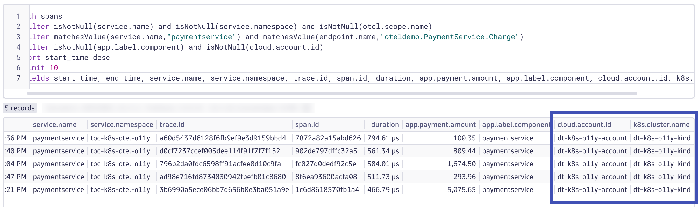

The spans now have the additional metadata, `cloud.account.id` and `k8s.cluster.name`.

Analyze a distributed trace and review the additional metadata.

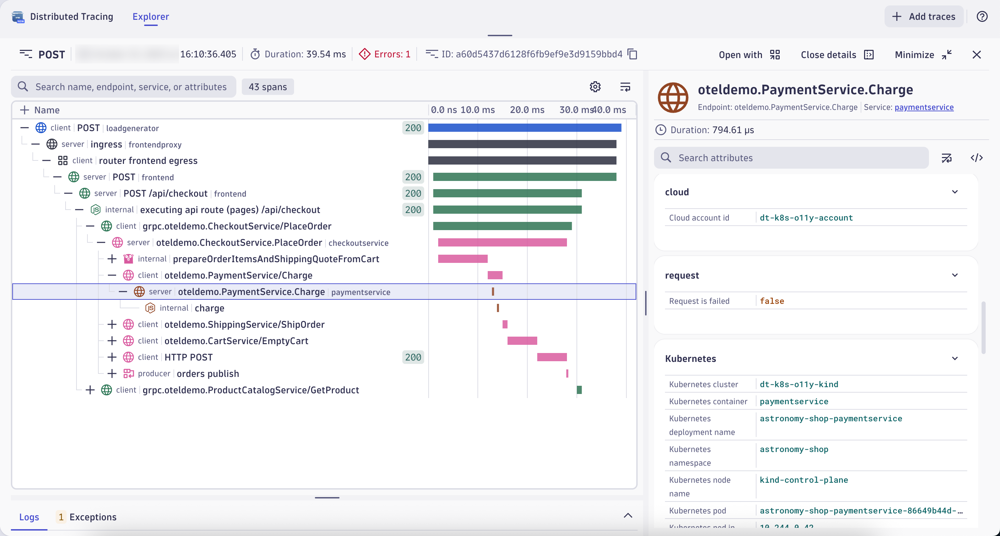

## resource Processor

### Add `resource` Processor

[OpenTelemetry Documentation](https://github.com/open-telemetry/opentelemetry-collector-contrib/tree/main/processor/resourceprocessor){target="_blank"}

The `resource` processor allows us to directly add, remove, or change resource attributes on the telemetry.  View the documentation for more details.

We will use this processor to make the follow changes to our telemetry:

* `k8s.pod.ip` values in our data are either the same or invalid; delete the useless attribute
* `telemetry.sdk.name` set to `opentelemetry` will allow us to easily identify data captured through OpenTelemetry
* `dynatrace.otel.collector` is a non-standardized attribute that we made up to help us identify which Collector captured this data
* `dt.security_context` is a Dynatrace specific attribute that we use to manage user permissions to the telemetry
    * This could also be set using OpenPipeline, but this puts control of this attribute's value at the app/infra layer (optionally)

```yaml
processors:
    resource:
        attributes:
        - key: k8s.pod.ip
          action: delete
        - key: telemetry.sdk.name
          value: opentelemetry
          action: insert
        - key: dynatrace.otel.collector
          value: dynatrace-traces
          action: insert
        - key: dt.security_context
          from_attribute: k8s.cluster.name
          action: insert
```
Command:
```sh
kubectl apply -f opentelemetry/collector/traces/otel-collector-traces-crd-04.yaml
```
Sample output:
> opentelemetrycollector.opentelemetry.io/dynatrace-traces configured

**Validate running pod(s)**

Command:
```sh
kubectl get pods -n dynatrace
```

Sample output:

| NAME                                       | READY | STATUS  | RESTARTS | AGE |
|--------------------------------------------|-------|---------|----------|-----|
| dynatrace-traces-collector-559d5b9d77-ny98q | 1/1   | Running | 0        | 1m  |


**OpenTelemetry Traces in Dynatrace with Custom Resource Attributes**

DQL:

```
fetch spans
| filter isNotNull(service.name) and isNotNull(service.namespace) and isNotNull(otel.scope.name)
| filter matchesValue(service.name,"paymentservice") and matchesValue(endpoint.name,"oteldemo.PaymentService.Charge")
| filter isNotNull(app.label.component) and isNotNull(cloud.account.id) and isNotNull(dynatrace.otel.collector)
| sort start_time desc
| limit 10
| fields start_time, end_time, service.name, service.namespace, trace.id, span.id, duration, app.payment.amount, app.label.component, cloud.account.id, k8s.cluster.name, dynatrace.otel.collector
```

Result:

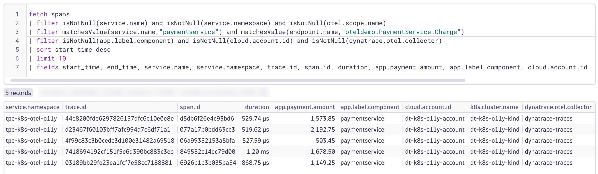

The spans now have the additional metadata, including `dynatrace.otel.collector`.

Analyze a distributed trace and review the additional metadata.

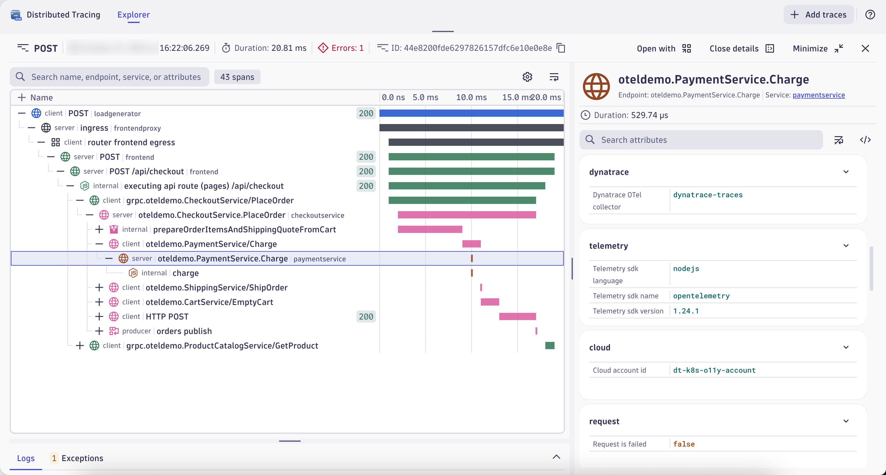

## Dynatrace Dashboard with Unified Services from OpenTelemetry

Open the Dashboard that you imported to view the throughput, response time, and failure metrics for the `astronomy-shop` application services.

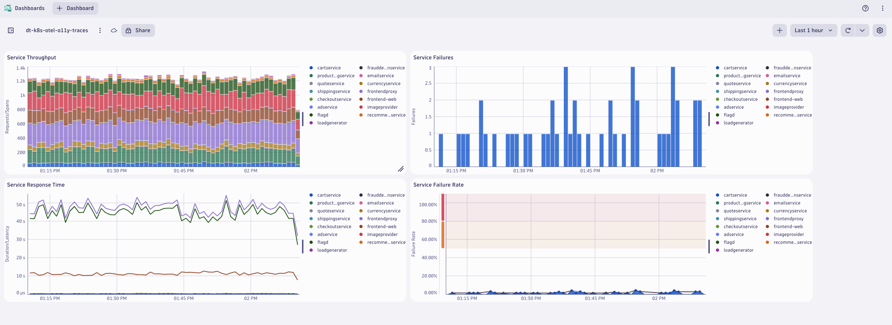

## Distributed Tracing App

The Distributed Tracing App provides a powerful interface for analyzing end-to-end traces across your services. Once you've identified a trace of interest—such as one containing the `PaymentService.Charge` span, you can use the app to drill into its full execution path.

The app offers multiple ways to locate relevant traces quickly:

* Filter bar: Use this to apply precise filters such as `service.name`, `span.kind`, or custom attributes like `app.payment.amount`.
* Segments: These predefined filters help you zero in on common trace patterns or service-specific activity.
* Facets: Dynamically generated from your trace data, facets allow you to pivot your search based on attributes like HTTP status codes, error flags, or user-defined tags.


Once you've applied your filters, the trace list updates in real time. From there, you can select a trace to view its waterfall visualization, which shows the sequence and timing of spans across services. This makes it easy to identify latency contributors, understand service interactions, and validate that your OpenTelemetry instrumentation is capturing the right context.


## Wrap Up

### What You Learned Today

By completing this lab, you've successfully deployed the OpenTelemetry Collector to collect traces, enrich span attributes for better context, and ship those traces/spans to Dynatrace for analysis.

- The OpenTelemetry Collector was deployed as a Deployment, behaving as a Gateway on the cluster
- The Dynatrace Distro of OpenTelemetry Collector includes supported modules needed to ship traces to Dynatrace
    * The `otlp` receiver receives traces (and other signals) from OpenTelemetry exporters via gRPC/HTTP
    * The `k8sattributes` processor enriches the spans with Kubernetes attributes
    * The `resourcedetection` processor enriches the spans with cloud and cluster (GCP/GKE) attributes
    * The `resource` processor enriches the spans with custom (resource) attributes
- Dynatrace allows you to perform powerful queries and analysis of the trace/span data

## Continue

In the next section, we'll ship metrics and datapoints from Kubernetes to Dynatrace using OpenTelemetry.

<div class="grid cards" markdown>
- [Continue to OpenTelemetry Metrics:octicons-arrow-right-24:](6-opentelemetry-metrics.md)
</div>