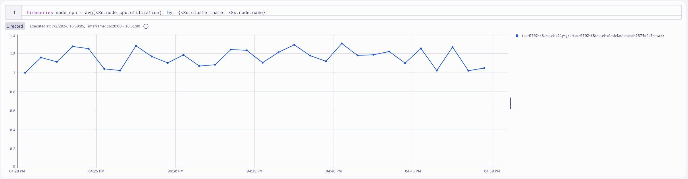
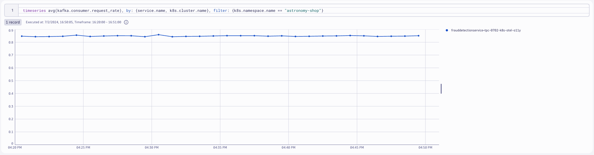
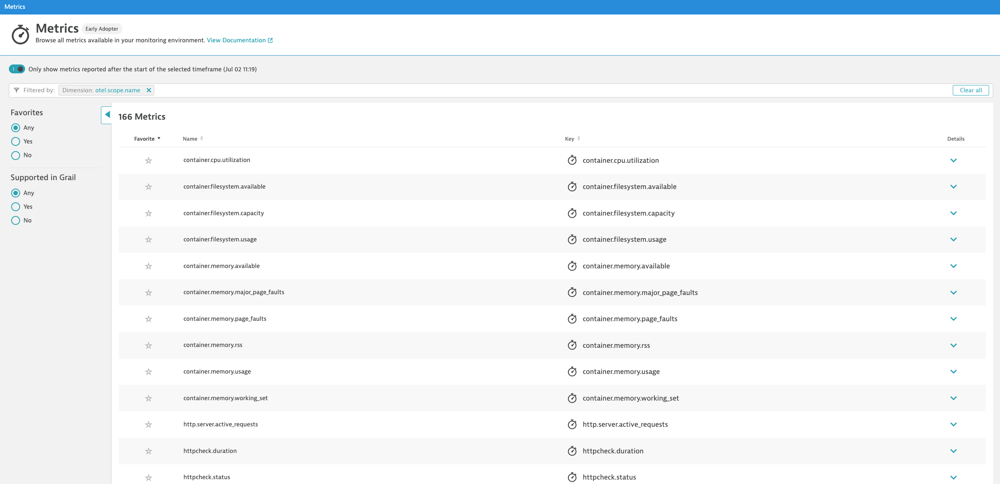

--8<-- "snippets/send-bizevent/6-opentelemetry-metrics.js"
# OpenTelemetry Metrics

In this lab module we'll utilize the OpenTelemetry Collector deployed as a DaemonSet (Node Agent) to collect Node (kubelet) metrics from a Kubernetes cluster and ship them to Dynatrace.  Additionally, we'll utilize a second OpenTelemetry Collector deployed as a Deployment (Gateway) to collect Cluster (Kubernetes API) metrics from the Kubernetes cluster and ship them to Dynatrace.

**Lab tasks:**

1. Deploy OpenTelemetry Collector as a DaemonSet
2. Configure OpenTelemetry Collector service pipeline for metric enrichment
3. Deploy OpenTelemetry Collector as a Deployment
4. Configure OpenTelemetry Collector service pipeline for metric enrichment
5. Query and visualize metrics in Dynatrace using DQL

<div class="grid cards" markdown>
- [Learn More:octicons-arrow-right-24:](https://docs.dynatrace.com/docs/ingest-from/opentelemetry){target="_blank"}
</div>

## Prerequisites

**Import Notebook into Dynatrace**

[Notebook](https://github.com/dynatrace-wwse/enablement-kubernetes-opentelemetry/blob/main/assets/dynatrace/notebooks/opentelemetry-metrics_dt_notebook.json){target="_blank"}

**Define workshop user variables**

In your Github Codespaces Terminal set the environment variables:

!!! tip "Sprint Environment"
    Are you using a Sprint environment for your Dynatrace tenant?  If so, then use `export DT_ENDPOINT=https://{your-environment-id}.sprint.dynatracelabs.com/api/v2/otlp` instead of the `live` version below.

```
export DT_ENDPOINT=https://{your-environment-id}.live.dynatrace.com/api/v2/otlp
export DT_API_TOKEN={your-api-token}
export NAME=<INITIALS>-k8s-otel-o11y
```

**Move into the metrics module directory**

Command:
```sh
cd $REPO_PATH/lab-modules/opentelemetry-metrics
```

## Collector for Node Metrics

**Kubernetes Node Metrics**

Each Kubernetes Node runs a kubelet that includes an API server. The `kubeletstats` Receiver connects to that kubelet via the API server to collect metrics about the node and the workloads running on the node.

### Deploy OpenTelemetry Collector 

**Dynatrace Distro - Daemonset (Node Agent)**

```yaml
---
apiVersion: opentelemetry.io/v1beta1
kind: OpenTelemetryCollector
metadata:
  name: dynatrace-metrics-node
  namespace: dynatrace
spec:
  envFrom:
  - secretRef:
      name: dynatrace-otelcol-dt-api-credentials
  env:
    - name: K8S_NODE_NAME
      valueFrom:
        fieldRef:
          fieldPath: spec.nodeName
  mode: "daemonset"
  image: "ghcr.io/dynatrace/dynatrace-otel-collector/dynatrace-otel-collector:latest"
```
Command:
```sh
kubectl apply -f opentelemetry/collector/metrics/otel-collector-metrics-node-crd-01.yaml
```
Sample output:
> opentelemetrycollector.opentelemetry.io/dynatrace-metrics-node created

**Validate running pod(s)**

Command:
```sh
kubectl get pods -n dynatrace
```

Sample output:

| NAME                             | READY | STATUS  | RESTARTS | AGE |
|----------------------------------|-------|---------|----------|-----|
| dynatrace-metrics-node-collector-2kzlp   | 1/1   | Running | 0        | 1m  |

### Configure Kubernetes RBAC

**Create `clusterrole` with read access to Kubernetes objects**

Since the receiver uses the Kubernetes API, it needs the correct permission to work correctly. For most use cases, you should give the service account running the Collector the following permissions via a ClusterRole.

```yaml
---
apiVersion: rbac.authorization.k8s.io/v1
kind: ClusterRole
metadata:
  name: otel-collector-k8s-clusterrole-metrics
rules:
  - apiGroups: ['']
    resources: ['events', 'namespaces', 'namespaces/status', 'nodes', 'nodes/spec', 'nodes/stats', 'nodes/proxy', 'pods', 'pods/status', 'replicationcontrollers', 'replicationcontrollers/status', 'resourcequotas', 'services']
    verbs: ['get', 'list', 'watch']
  - apiGroups: ['apps']
    resources: ['daemonsets', 'deployments', 'replicasets', 'statefulsets']
    verbs: ['get', 'list', 'watch']
  - apiGroups: ['extensions']
    resources: ['daemonsets', 'deployments', 'replicasets']
    verbs: ['get', 'list', 'watch']
  - apiGroups: ['batch']
    resources: ['jobs', 'cronjobs']
    verbs: ['get', 'list', 'watch']
  - apiGroups: ['autoscaling']
    resources: ['horizontalpodautoscalers']
    verbs: ['get', 'list', 'watch']
```

Command:
```sh
kubectl apply -f opentelemetry/rbac/otel-collector-k8s-clusterrole-metrics.yaml
```
Sample output:
> clusterrole.rbac.authorization.k8s.io/otel-collector-k8s-clusterrole-metrics created

**Create `clusterrolebinding` for OpenTelemetry Collector service account**

```yaml
---
apiVersion: rbac.authorization.k8s.io/v1
kind: ClusterRoleBinding
metadata:
  name: otel-collector-k8s-clusterrole-metrics-crb
subjects:
- kind: ServiceAccount
  name: dynatrace-metrics-node-collector
  namespace: dynatrace
roleRef:
  kind: ClusterRole
  name: otel-collector-k8s-clusterrole-metrics
  apiGroup: rbac.authorization.k8s.io
```
Command:
```sh
kubectl apply -f opentelemetry/rbac/otel-collector-k8s-clusterrole-metrics-crb.yaml
```
Sample output:
> clusterrolebinding.rbac.authorization.k8s.io/otel-collector-k8s-clusterrole-metrics-crb created

### `kubeletstats` receiver
[OpenTelemetry Documentation](https://opentelemetry.io/docs/kubernetes/collector/components/#kubeletstats-receiver){target="_blank"}

By default, metrics will be collected for pods and nodes, but you can configure the receiver to collect container and volume metrics as well. The receiver also allows configuring how often the metrics are collected:

```yaml
config:
    receivers:
      kubeletstats:
        collection_interval: 30s
        auth_type: 'serviceAccount'
        endpoint: '${env:K8S_NODE_NAME}:10250'
        insecure_skip_verify: true
        metric_groups:
          - node
          - pod
          - container
```

**Default Metrics:** [OpenTelemetry Documentation](https://github.com/open-telemetry/opentelemetry-collector-contrib/blob/main/receiver/kubeletstatsreceiver/documentation.md){target="_blank"}

**note:** for this lab, the Kind cluster does not have cluster metadata to collect.  These values will be spoofed for the purposes of this lab.

```yaml
resource/kind:
  attributes:
  - key: k8s.cluster.name
    value: dt-k8s-o11y-kind
    action: insert
```

**Query Node metrics in Dynatrace**

DQL:
```sql
timeseries node_cpu = avg(k8s.node.cpu.usage), by: {k8s.cluster.name, k8s.node.name}
```
Result:



### k8sattributes Processor

The Kubernetes Attributes Processor automatically discovers Kubernetes pods, extracts their metadata, and adds the extracted metadata to spans, metrics, and logs as resource attributes.

The Kubernetes Attributes Processor is one of the most important components for a collector running in Kubernetes. Any collector receiving application data should use it. Because it adds Kubernetes context to your telemetry, the Kubernetes Attributes Processor lets you correlate your application’s traces, metrics, and logs signals with your Kubernetes telemetry, such as pod metrics and traces.

**Add `k8sattributes` processor**

[OpenTelemetry Documentation](https://opentelemetry.io/docs/kubernetes/collector/components/#kubernetes-attributes-processor){target="_blank"}

The `k8sattributes` processor will query metadata from the cluster about the k8s objects.  The Collector will then marry this metadata to the telemetry.

```yaml
k8sattributes:
  auth_type: "serviceAccount"
  passthrough: false
  filter:
    node_from_env_var: KUBE_NODE_NAME
  extract:
    metadata:
      - k8s.namespace.name
      - k8s.deployment.name
      - k8s.daemonset.name
      - k8s.job.name
      - k8s.cronjob.name
      - k8s.replicaset.name
      - k8s.statefulset.name
      - k8s.pod.name
      - k8s.pod.uid
      - k8s.node.name
      - k8s.container.name
      - container.id
      - container.image.name
      - container.image.tag
    labels:
      - tag_name: app.label.component
        key: app.kubernetes.io/component
        from: pod
    pod_association:
      - sources:
          - from: resource_attribute
            name: k8s.pod.uid
      - sources:
          - from: resource_attribute
            name: k8s.pod.name
      - sources:
          - from: resource_attribute
            name: k8s.pod.ip
      - sources:
          - from: connection
```
Command:
```sh
kubectl apply -f opentelemetry/collector/metrics/otel-collector-metrics-node-crd-02.yaml
```
Sample output:
> opentelemetrycollector.opentelemetry.io/dynatrace-metrics-node configured

**Validate running pod(s)**

Command:
```sh
kubectl get pods -n dynatrace
```

Sample output:

| NAME                             | READY | STATUS  | RESTARTS | AGE |
|----------------------------------|-------|---------|----------|-----|
| dynatrace-metrics-node-collector-drk1p   | 1/1   | Running | 0        | 1m  |

**Query Pod metrics in Dynatrace**

DQL:
```sql
timeseries pod_cpu = avg(k8s.pod.cpu.usage), by: { k8s.pod.name, k8s.node.name, k8s.namespace.name, k8s.deployment.name, k8s.cluster.name, k8s.pod.uid }
| filter k8s.namespace.name == "astronomy-shop" and k8s.deployment.name == "astronomy-shop-productcatalogservice"
```

Result:


## Collector for Cluster Metrics

The Kubernetes Cluster Receiver collects metrics and entity events about the cluster as a whole using the Kubernetes API server. Use this receiver to answer questions about pod phases, node conditions, and other cluster-wide questions.

### Deploy OpenTelemetry Collector

**Dynatrace Distro - Deployment (Gateway)**

[OpenTelemetry Documentation](https://github.com/open-telemetry/opentelemetry-operator){target="_blank"}

Since the receiver gathers telemetry for the cluster as a whole, only one instance of the receiver is needed across the cluster in order to collect all the data.  The Collector will be deployed as a Deployment (Gateway).

```yaml
---
apiVersion: opentelemetry.io/v1beta1
kind: OpenTelemetryCollector
metadata:
  name: dynatrace-metrics-cluster
  namespace: dynatrace
spec:
  envFrom:
  - secretRef:
      name: dynatrace-otelcol-dt-api-credentials
  mode: "deployment"
  image: "ghcr.io/dynatrace/dynatrace-otel-collector/dynatrace-otel-collector:latest"
```
Command:
```sh
kubectl apply -f opentelemetry/collector/metrics/otel-collector-metrics-cluster-crd-01.yaml
```
Sample output:
> opentelemetrycollector.opentelemetry.io/dynatrace-metrics-cluster created

**Validate running pod(s)**

Command:
```sh
kubectl get pods -n dynatrace
```

Sample output:

| NAME                             | READY | STATUS  | RESTARTS | AGE |
|----------------------------------|-------|---------|----------|-----|
| dynatrace-metrics-cluster-collector-7bd8dc4995-6sgs2   | 1/1   | Running | 0        | 1m  |

### `k8s_cluster` receiver

[OpenTelemetry Documentation](https://opentelemetry.io/docs/kubernetes/collector/components/#kubernetes-cluster-receiver){target="_blank"}

```yaml
config:
    receivers:
      k8s_cluster:
        collection_interval: 60s
        node_conditions_to_report: [ "Ready", "MemoryPressure", "DiskPressure" ]
        allocatable_types_to_report: [ "cpu","memory" ]
        metadata_collection_interval: 5m
```
**Default Metrics:** [OpenTelemetry Documentation](https://github.com/open-telemetry/opentelemetry-collector-contrib/blob/main/receiver/k8sclusterreceiver/documentation.md){target="_blank"}

**Query Deployment metrics in Dynatrace**

DQL:
```sql
timeseries pods_avail = min(k8s.deployment.available), by: {k8s.cluster.name, k8s.deployment.name}, filter: {k8s.namespace.name == "astronomy-shop"}
```
Result:


## Export Application Metrics

The `astronomy-shop` demo application has the OpenTelemetry agents and SDKs already instrumented.  These agents and SDKs are generating metrics (traces and logs too) that are being exported to a Collector running within the `astronomy-shop` namespace bundled into the application deployment.  We want these metrics to be shipped to Dynatrace as well.

### `otlp` receiver

[OpenTelemetry Documentation](https://github.com/open-telemetry/opentelemetry-collector/tree/main/receiver/otlpreceiver){target="_blank"}

Adding the `otlp` receiver allows us to receive telemetry from otel exporters, such as agents and other collectors.

```yaml
config:
    receivers:
      otlp:
        protocols:
          grpc:
            endpoint: 0.0.0.0:4317
          http:
            endpoint: 0.0.0.0:4318
    service:
      pipelines:
        metrics:
          receivers: [otlp]
          processors: [batch]
          exporters: [otlphttp/dynatrace]
```

**Export OpenTelemetry data from `astronomy-shop` to OpenTelemetry Collector - Dynatrace Distro**

**Customize astronomy-shop helm values**

OpenTelemetry data created by agents and SDKs should include `service.name` and `service.namespace` attributes.  We will make the `service.namespace` unique to our deployment using our `NAME` environment variable declared earlier, using a `sed` command on the Helm chart's `values.yaml` file.

```yaml
default:
  # List of environment variables applied to all components
  env:
    - name: OTEL_SERVICE_NAME
      valueFrom:
        fieldRef:
          apiVersion: v1
          fieldPath: "metadata.labels['app.kubernetes.io/component']"
    - name: OTEL_COLLECTOR_NAME
      value: '{{ include "otel-demo.name" . }}-otelcol'
    - name: OTEL_EXPORTER_OTLP_METRICS_TEMPORALITY_PREFERENCE
      value: cumulative
    - name: OTEL_RESOURCE_ATTRIBUTES
      value: 'service.name=$(OTEL_SERVICE_NAME),service.namespace=NAME_TO_REPLACE,service.version={{ .Chart.AppVersion }}'
```
> service.namespace=NAME_TO_REPLACE\
> service.namespace=INITIALS-k8s-otel-o11y

Command:
```sh
sed "s,NAME_TO_REPLACE,$NAME," astronomy-shop/collector-values.yaml > astronomy-shop/sed/collector-values.yaml
```

**Update `astronomy-shop` OpenTelemetry Collector export endpoint via helm**

Our `collector-values.yaml` contains new configurations for the application so that the `astronomy-shop` Collector includes exporters that ship to the Collectors deployed in the `dynatrace` namespace.

```yaml
exporters:
  # Dynatrace OTel Collectors
  otlphttp/dttraces:
    endpoint: http://dynatrace-traces-collector.dynatrace.svc.cluster.local:4318
  otlphttp/dtlogs:
    endpoint: http://dynatrace-logs-collector.dynatrace.svc.cluster.local:4318
  otlphttp/dtmetrics:
    endpoint: http://dynatrace-metrics-cluster-collector.dynatrace.svc.cluster.local:4318
```

Command:
```sh
helm upgrade astronomy-shop open-telemetry/opentelemetry-demo --values astronomy-shop/sed/collector-values.yaml --namespace astronomy-shop --version "0.31.0"
```
Sample output:
> NAME: astronomy-shop\
> LAST DEPLOYED: Thu Jun 27 20:58:38 2024\
> NAMESPACE: astronomy-shop\
> STATUS: deployed\
> REVISION: 2

**Query `astronomy-shop` metrics in Dynatrace**

DQL:
```sql
timeseries jvm_mem_used = avg(jvm.memory.used), by: {service.name, k8s.cluster.name}, filter: {k8s.namespace.name == "astronomy-shop"}
```
Result:


DQL:
```sql
timeseries avg(kafka.consumer.request_rate), by: {service.name, k8s.cluster.name}, filter: {k8s.namespace.name == "astronomy-shop"}
```
Result:



**Browse available metrics in Dynatrace**
<!-- TODO: Update to Grail query in Notebook, remove classic screen -->

You can browse all available metrics from OpenTelemetry sources in the Metrics Browser.  Filter on `Dimension:otel.scope.name` to find relevant metrics.

[Dynatrace Documentation](https://docs.dynatrace.com/docs/observe-and-explore/dashboards-classic/metrics-browser){target="_blank"}



## Wrap Up

### What You Learned Today

By completing this lab, you've successfully deployed the OpenTelemetry Collector to collect metrics, enrich metric attributes for better context, and ship those metrics to Dynatrace for analysis.

- One Dynatrace Distro OpenTelemetry Collector was deployed as a DaemonSet, behaving as an Agent running on each Node
    * The `kubeletstats` receiver scrapes metrics from the local kubelet on the Node
    * The `k8sattributes` processor enriches the metrics with Kubernetes attributes that may be missing without it
- A second Dynatrace Distro OpenTelemetry Collector was deployed as a Deployment, behaving as a Gateway
    * The `k8s_cluster` receiver queries the Kubernetes cluster API to retrieve metrics
    * The `k8sattributes` processor enriches the metrics with Kubernetes attributes that may be missing without it
    * The `otlp` receiver receives signals that are exported from agents, SDKs, and other Collectors
- Metrics produced by the OpenTelemetry SDKs and Agents are exported to the `otlp` receiver
- Dynatrace DQL (via Notebooks) allows you to perform powerful queries and analysis of the metric data

## Continue

In the next section, we'll integrate and apply what we have learned in the OpenTelemetry Capstone.

<div class="grid cards" markdown>
- [Continue to OpenTelemetry Capstone:octicons-arrow-right-24:](7-opentelemetry-capstone.md)
</div>