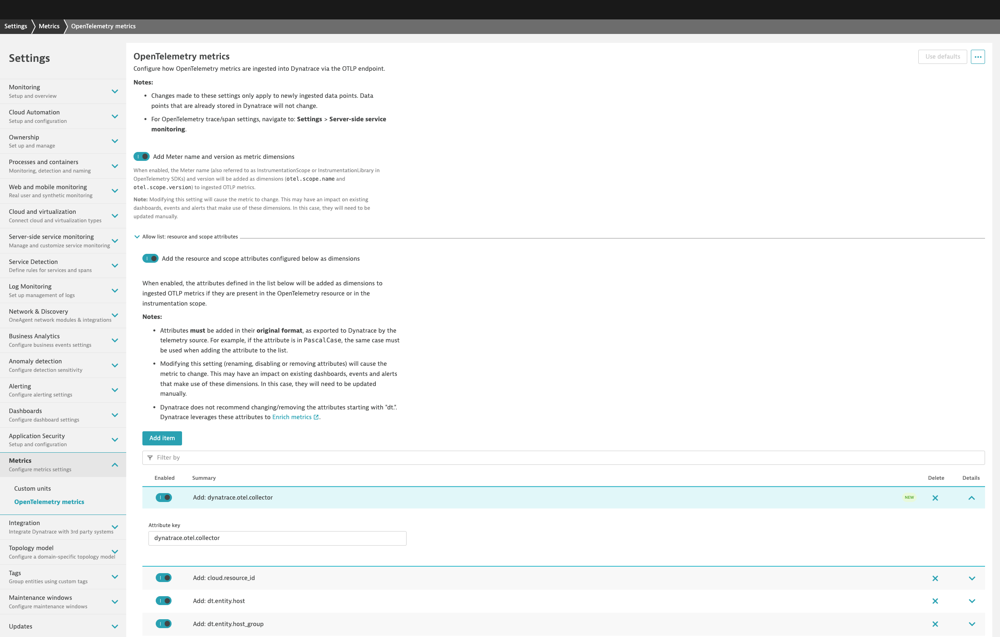

--8<-- "snippets/send-bizevent/7-opentelemetry-capstone.js"
# OpenTelemetry Capstone

!!! tip "Capstone Module"
    What is a **Capstone**? A hands-on, culminating learning experience where participants apply the knowledge and skills they've gained throughout a course or program to solve a real-world problem, create a project, or present a comprehensive solution.

In this lab module we'll utilize multiple OpenTelemetry Collectors to collect application traces/spans, log records, and metric data points generated by OpenTelemetry, from a Kubernetes cluster and ship them to Dynatrace.  This is a capstone lab that utilizes the concepts of the previous Kubernetes OpenTelemetry lab modules.

**Lab tasks:**

1. Deploy 2 OpenTelemetry Collectors
2. Configure OpenTelemetry Collector service pipeline for data enrichment
3. Analyze metrics, traces, and logs in Dynatrace
4. Observe OpenTelemetry Collector health in Dynatrace

<div class="grid cards" markdown>
- [Learn More:octicons-arrow-right-24:](https://docs.dynatrace.com/docs/ingest-from/opentelemetry/collector){target="_blank"}
</div>

## Prerequisites

**Import Dashboard into Dynatrace**


[astronomy-shop dashboard](https://github.com/dynatrace-wwse/enablement-kubernetes-opentelemetry/blob/main/assets/dynatrace/dashboards/opentelemetry-capstone_dt_dashboard.json){target="_blank"}

**Add OpenTelemetry Dashboards from Hub**

Locate the OpenTelemetry Dashboards App in the Hub.  Install the App to have OpenTelemetry Collector self-monitoring and Kubernetes monitoring dashboards added to your environment.


**Define workshop user variables**
In your Github Codespaces Terminal set the environment variables:

!!! tip "Sprint Environment"
    Are you using a Sprint environment for your Dynatrace tenant?  If so, then use `export DT_ENDPOINT=https://{your-environment-id}.sprint.dynatracelabs.com/api/v2/otlp` instead of the `live` version below.

```
export DT_ENDPOINT=https://{your-environment-id}.live.dynatrace.com/api/v2/otlp
export DT_API_TOKEN={your-api-token}
export NAME=<INITIALS>-k8s-otel-o11y
```

**Move into the capstone module directory**

Command:
```sh
cd $REPO_PATH/lab-modules/opentelemetry-capstone
```

**Clean Up Previous Deployments**

Delete `dynatrace` namespace and all previous deployments

Command:
```sh
kubectl delete ns dynatrace
```

## OpenTelemetry Operator and Role Based Access

**Deploy OpenTelemetry Operator**

**Create `dynatrace` namespace**

Command:
```sh
kubectl create namespace dynatrace
```
Sample output:
> namespace/dynatrace created

**Create `dynatrace-otelcol-dt-api-credentials` secret**

The secret holds the API endpoint and API token that OpenTelemetry data will be sent to.

Command:
```sh
kubectl create secret generic dynatrace-otelcol-dt-api-credentials --from-literal=DT_ENDPOINT=$DT_ENDPOINT --from-literal=DT_API_TOKEN=$DT_API_TOKEN -n dynatrace
```
Sample output:
> secret/dynatrace-otelcol-dt-api-credentials created

**Deploy `cert-manager`, pre-requisite for `opentelemetry-operator`**

[Cert Manager Documentation](https://cert-manager.io/docs/installation/){target="_blank"}

Command:
```sh
kubectl apply -f opentelemetry/cert-manager.yaml
```
Sample output:
> namespace/cert-manager created\
> customresourcedefinition.apiextensions.k8s.io/certificaterequests.cert-manager.io created\
> customresourcedefinition.apiextensions.k8s.io/certificates.cert-manager.io created\
> ...\
> validatingwebhookconfiguration.admissionregistration.k8s.io/cert-manager-webhook created

Wait 30-60 seconds for cert-manager to finish initializing before continuing.

**Deploy `opentelemetry-operator`**

The OpenTelemetry Operator will deploy and manage the custom resource `OpenTelemetryCollector` deployed on the cluster.

Command:
```sh
kubectl apply -f opentelemetry/opentelemetry-operator.yaml
```
Sample output:
> namespace/opentelemetry-operator-system created\
> customresourcedefinition.apiextensions.k8s.io/instrumentations.opentelemetry.io created\
> customresourcedefinition.apiextensions.k8s.io/opampbridges.opentelemetry.io created\
> ...\
> validatingwebhookconfiguration.admissionregistration.k8s.io/opentelemetry-operator-validating-webhook-configuration configured

Wait 30-60 seconds for opentelemetry-operator-controller-manager to finish initializing before continuing.

Validate that the OpenTelemetry Operator components are running.

Command:
```sh
kubectl get pods -n opentelemetry-operator-system
```

Sample output:

| NAME                             | READY | STATUS  | RESTARTS | AGE |
|----------------------------------|-------|---------|----------|-----|
| opentelemetry-operator-controller-manager-5d746dbd64-rf9st   | 2/2   | Running | 0        | 1m  |

**Create `clusterrole` with read access to Kubernetes objects**

```yaml
---
apiVersion: rbac.authorization.k8s.io/v1
kind: ClusterRole
metadata:
  name: otel-collector-k8s-clusterrole
rules:
  - apiGroups: ['']
    resources: ['events', 'namespaces', 'namespaces/status', 'nodes', 'nodes/spec', 'nodes/stats', 'nodes/proxy', 'pods', 'pods/status', 'replicationcontrollers', 'replicationcontrollers/status', 'resourcequotas', 'services']
    verbs: ['get', 'list', 'watch']
  - apiGroups: ['apps']
    resources: ['daemonsets', 'deployments', 'replicasets', 'statefulsets']
    verbs: ['get', 'list', 'watch']
  - apiGroups: ['extensions']
    resources: ['daemonsets', 'deployments', 'replicasets']
    verbs: ['get', 'list', 'watch']
  - apiGroups: ['batch']
    resources: ['jobs', 'cronjobs']
    verbs: ['get', 'list', 'watch']
  - apiGroups: ['autoscaling']
    resources: ['horizontalpodautoscalers']
    verbs: ['get', 'list', 'watch']
```
Command:
```sh
kubectl apply -f opentelemetry/rbac/otel-collector-k8s-clusterrole.yaml
```
Sample output:
> clusterrole.rbac.authorization.k8s.io/otel-collector-k8s-clusterrole created

**Create `clusterrolebinding` for OpenTelemetry Collector service accounts**

```yaml
---
apiVersion: rbac.authorization.k8s.io/v1
kind: ClusterRoleBinding
metadata:
  name: otel-collector-k8s-clusterrole-crb
subjects:
- kind: ServiceAccount
  name: dynatrace-deployment-collector
  namespace: dynatrace
- kind: ServiceAccount
  name: dynatrace-daemonset-collector
  namespace: dynatrace
roleRef:
  kind: ClusterRole
  name: otel-collector-k8s-clusterrole
  apiGroup: rbac.authorization.k8s.io
```
Command:
```sh
kubectl apply -f opentelemetry/rbac/otel-collector-k8s-clusterrole-crb.yaml
```
Sample output:
> clusterrolebinding.rbac.authorization.k8s.io/otel-collector-k8s-clusterrole-crb created

## Dynatrace Deployment Collector

**OpenTelemetry Collector - Dynatrace Distro (Deployment)**

[Dynatrace Documentation](https://docs.dynatrace.com/docs/extend-dynatrace/opentelemetry/collector/deployment){target=_blank}

Receivers:
`otlp`, `prometheus`, `k8s_cluster`, `k8sobjects`

| MODULE        | DT DEPLOY | DT DAEMON |
|---------------|-----------|-----------|
| otlp          | - [x]     | - [ ]     |
| prometheus    | - [x]     | - [x]     |
| filelog       | - [ ]     | - [x]     |
| kubeletstats  | - [ ]     | - [x]     |
| k8s_cluster   | - [x]     | - [ ]     |
| k8sobjects    | - [x]     | - [ ]     |

**Deploy OpenTelemetry Collector CRD**

[Dynatrace Documentation](https://docs.dynatrace.com/docs/extend-dynatrace/opentelemetry/collector/deployment#tabgroup--dynatrace-docs--gateway){target="_blank"}
```yaml
---
apiVersion: opentelemetry.io/v1beta1
kind: OpenTelemetryCollector
metadata:
  name: dynatrace-deployment
  namespace: dynatrace
spec:
  envFrom:
  - secretRef:
      name: dynatrace-otelcol-dt-api-credentials
  mode: "deployment"
  image: "ghcr.io/dynatrace/dynatrace-otel-collector/dynatrace-otel-collector:latest"
```
Command:
```sh
kubectl apply -f opentelemetry/collector/dynatrace/otel-collector-dynatrace-deployment-crd.yaml
```
Sample output:
> opentelemetrycollector.opentelemetry.io/dynatrace-deployment created

**Validate running pod(s)**

Command:
```sh
kubectl get pods -n dynatrace
```

Sample output:

| NAME                                       | READY | STATUS  | RESTARTS | AGE |
|--------------------------------------------|-------|---------|----------|-----|
| dynatrace-deployment-collector-796546fbd6-kqflf | 1/1   | Running | 0        | 1m  |

## Dynatrace Daemonset Collector

**OpenTelemetry Collector - Dynatrace Distro (Daemonset)**

[Dynatrace Documentation](https://docs.dynatrace.com/docs/extend-dynatrace/opentelemetry/collector/deployment){target="_blank"}

Receivers:
`filelog`, `prometheus`, `kubeletstats`

| MODULE        | DT DEPLOY | DT DAEMON |
|---------------|-----------|-----------|
| otlp          | - [x]     | - [ ]     |
| prometheus    | - [x]     | - [x]     |
| filelog       | - [ ]     | - [x]     |
| kubeletstats  | - [ ]     | - [x]     |
| k8s_cluster   | - [x]     | - [ ]     |
| k8sobjects    | - [x]     | - [ ]     |

**Deploy OpenTelemetry Collector CRD**

[Dynatrace Documentation](https://docs.dynatrace.com/docs/extend-dynatrace/opentelemetry/collector/deployment#tabgroup--dynatrace-docs--agent){target="_blank"}

```yaml
---
apiVersion: opentelemetry.io/v1beta1
kind: OpenTelemetryCollector
metadata:
  name: dynatrace-daemonset
  namespace: dynatrace
spec:
  envFrom:
  - secretRef:
      name: dynatrace-otelcol-dt-api-credentials
  mode: "daemonset"
  image: "ghcr.io/dynatrace/dynatrace-otel-collector/dynatrace-otel-collector:latest"
```
Command:
```sh
kubectl apply -f opentelemetry/collector/dynatrace/otel-collector-dynatrace-daemonset-crd.yaml
```
Sample output:
> opentelemetrycollector.opentelemetry.io/dynatrace-daemonset created

**Validate running pod(s)**

Command:
```sh
kubectl get pods -n dynatrace
```

Sample output:

| NAME                                       | READY | STATUS  | RESTARTS | AGE |
|--------------------------------------------|-------|---------|----------|-----|
| dynatrace-daemonset-collector-h69pz | 1/1   | Running | 0        | 1m  |

## Configure Astronomy Shop OTLP Export

```yaml
config:
    receivers:
      otlp:
        protocols:
          http:
            # Since this collector needs to receive data from the web, enable cors for all origins
            # `allowed_origins` can be refined for your deployment domain
            cors:
              allowed_origins:
                - "http://*"
                - "https://*"
      httpcheck/frontendproxy:
        targets:
          - endpoint: 'http://{{ include "otel-demo.name" . }}-frontendproxy:8080'

    exporters:
      # Dynatrace OTel Collector
      otlphttp/dynatrace:
        endpoint: http://dynatrace-deployment-collector.dynatrace.svc.cluster.local:4318

    processors:
      resource:
        attributes:
        - key: service.instance.id
          from_attribute: k8s.pod.uid
          action: insert

    connectors:
      spanmetrics: {}

    service:
      pipelines:
        traces:
          receivers: [otlp]
          processors: [memory_limiter, resource, batch]
          exporters: [spanmetrics, otlphttp/dynatrace]
        metrics:
          receivers: [httpcheck/frontendproxy, otlp, spanmetrics]
          processors: [memory_limiter, resource, batch]
          exporters: [otlphttp/dynatrace]
        logs:
          processors: [memory_limiter, resource, batch]
          exporters: [otlphttp/dynatrace]
```

**Export OpenTelemetry data from `astronomy-shop` to OpenTelemetry Collector - Dynatrace Distro (Deployment)**

Customize astronomy-shop helm values

```yaml
default:
  # List of environment variables applied to all components
  env:
    - name: OTEL_SERVICE_NAME
      valueFrom:
        fieldRef:
          apiVersion: v1
          fieldPath: "metadata.labels['app.kubernetes.io/component']"
    - name: OTEL_COLLECTOR_NAME
      value: '{{ include "otel-demo.name" . }}-otelcol'
    - name: OTEL_EXPORTER_OTLP_METRICS_TEMPORALITY_PREFERENCE
      value: cumulative
    - name: OTEL_RESOURCE_ATTRIBUTES
      value: 'service.name=$(OTEL_SERVICE_NAME),service.namespace=NAME_TO_REPLACE,service.version={{ .Chart.AppVersion }}'
```
> service.namespace=NAME_TO_REPLACE\
> service.namespace=INITIALS-k8s-otel-o11y

Command:
```sh
sed "s,NAME_TO_REPLACE,$NAME," astronomy-shop/collector-values.yaml > astronomy-shop/sed/collector-values.yaml
```

Update `astronomy-shop` OpenTelemetry Collector export endpoint via helm

Command:
```sh
helm upgrade astronomy-shop open-telemetry/opentelemetry-demo --values astronomy-shop/sed/collector-values.yaml --namespace astronomy-shop --version "0.31.0"
```
Sample output:
> NAME: astronomy-shop\
> LAST DEPLOYED: Thu Jun 27 20:58:38 2024\
> NAMESPACE: astronomy-shop\
> STATUS: deployed\
> REVISION: 2

## Validate and Analyze Data in Dynatrace

**Analyze metrics, traces, and logs in Dynatrace dashboard**


[astronomy-shop dashboard](https://github.com/dynatrace-wwse/enablement-kubernetes-opentelemetry/blob/main/assets/dynatrace/dashboards/opentelemetry-capstone_dt_dashboard.json){target="_blank"}

## OpenTelemetry Collector Health

### Observe OpenTelemetry Collector health in Dynatrace
[OpenTelemetry Documentation](https://opentelemetry.io/docs/collector/internal-telemetry/){target="_blank"}

* Add `dynatrace.otel.collector` to Dynatrace's metric attribute allow list
* Enable OpenTelemetry Collector self-monitoring telemetry
* View OpenTelemetry Collector self-mon health metrics in Dynatrace

**Add `dynatrace.otel.collector` to Dynatrace's metric attribute allow list**

By default, the metric attribute `dynatrace.otel.collector` is dropped by Dynatrace.  Add it to the allow list in your Dynatrace tenant:

[Dynatrace Documentation](https://docs.dynatrace.com/docs/extend-dynatrace/opentelemetry/getting-started/metrics/configuration){target="_blank"}


**Enable OpenTelemetry Collector self-monitoring telemetry**

Add telemetry service to Collector config:
```yaml
service:
  telemetry:
    logs:
      level: "info"
      encoding: "json"
    metrics:
      level: "detailed"
      # set up OTLP exporter to self OTLP receiver
      readers:
        - periodic:
            interval: 10000
            timeout: 5000
            exporter:
              otlp:
                protocol: http/protobuf
                temporality_preference: delta
                endpoint: "http://${env:MY_POD_IP}:4318/v1/metrics"
```

For more details and the latest information, see the [Dynatrace Documentation](https://docs.dynatrace.com/docs/ingest-from/opentelemetry/collector/self-monitoring){target="_blank"} for Collector self-monitoring.

**View OpenTelemetry Collector self-mon health metrics in Dynatrace**

OpenTelemetry Collector self-mon metrics have the `otelcol_` prefix and can be found in the Dynatrace metric browser:


You can also query the metric series (metric key + dimensions) using DQL:
```sql
fetch metric.series
| filter startsWith(metric.key,"otelcol_")
```

Use the ready-made dashboards from OpenTelemetry Dashboards to view and analyze the OpenTelemetry Collector health.


## Wrap Up

### What You Learned Today

By completing this lab, you've successfully deployed the OpenTelemetry Collector to collect metrics, traces, and logs from Kubernetes and ship them to Dynatrace for analysis.

- The Dynatrace Distro of OpenTelemetry Collector includes supported modules needed to ship telemetry to Dynatrace
    - The `otlp` receiver receives metrics, traces, and logs from OpenTelemetry exporters via gRPC/HTTP
    - The `filelog` receiver scrapes logs from the Node filesystem and parses the contents
    - The `prometheus` receiver scrapes metric data exposed by Pod Prometheus endpoints
    - The `kubeletstats` receiver scrapes metrics from the local kubelet on the Node
    - The `k8s_cluster` receiver queries the Kubernetes cluster API to retrieve metrics
    - The `k8sobjects` receiver watches for Kubernetes events (and other resources) on the cluster
- Dynatrace allows you to perform powerful queries and analysis of the telemetry data
- Observing the health of the OpenTelemetry Collectors and data pipeline is critical
    - The OpenTelemetry Collector exposes self-monitoring metrics and emits logs

## Continue

Now that the lab has been completed, let's summarize what we have learned and clean up our Codespaces instance.

<div class="grid cards" markdown>
- [Continue to cleanup:octicons-arrow-right-24:](cleanup.md)
</div>