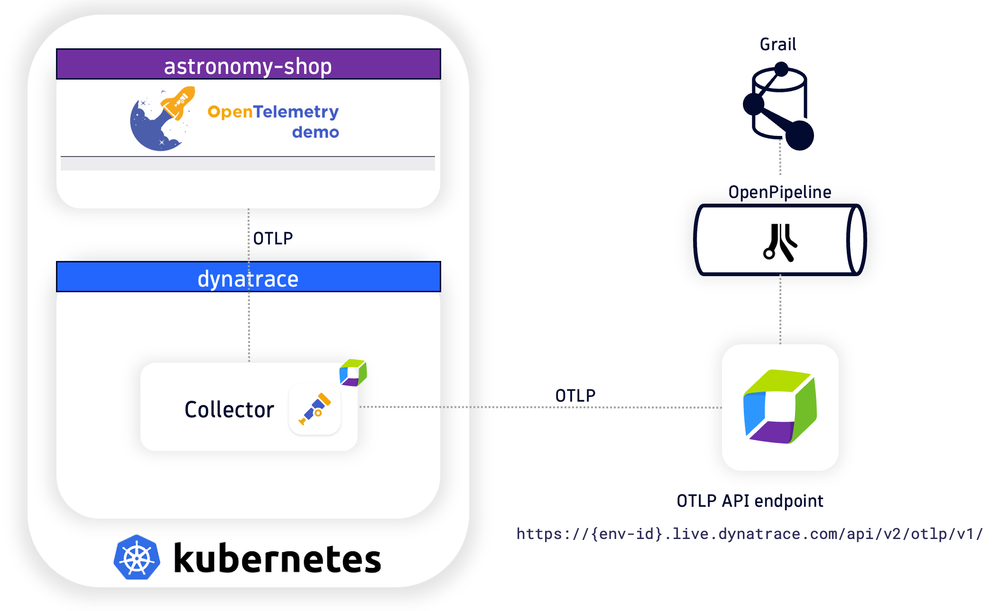

--8<-- "snippets/send-bizevent/index.js"
# Kubernetes OpenTelemetry

--8<-- "snippets/disclaimer.md"

## Lab Overview

During this hands-on training, we’ll learn how to capture logs, traces, and metrics from Kubernetes using OpenTelemetry and ship them to Dynatrace for analysis.  This will demonstrate how to use Dynatrace with OpenTelemetry; without any Dynatrace native components installed on the Kubernetes cluster (Operator, OneAgent, ActiveGate, etc.).

**Lab tasks:**

1. OpenTelemetry Logs

    - Deploy OpenTelemetry Collector as a DaemonSet
    - Deploy OpenTelemetry Collector as a Deployment
    - Configure OpenTelemetry Collector service pipeline for log enrichment
    - Query and visualize logs in Dynatrace using DQL

2. OpenTelemetry Traces

    - Deploy OpenTelemetry Collector as a Deployment
    - Configure OpenTelemetry Collector service pipeline for span enrichment
    - Analyze application reliability via traces in Dynatrace

3. OpenTelemetry Metrics

    - Deploy OpenTelemetry Collector as a DaemonSet
    - Configure OpenTelemetry Collector service pipeline for metric enrichment
    - Deploy OpenTelemetry Collector as a Deployment
    - Configure OpenTelemetry Collector service pipeline for metric enrichment
    - Query and visualize metrics in Dynatrace using DQL

4. OpenTelemetry Capstone

    - Deploy 2 OpenTelemetry Collectors (DaemonSet + Deployment)
    - Configure OpenTelemetry Collector service pipeline for data enrichment
    - Analyze metrics, traces, and logs in Dynatrace
    - Observe OpenTelemetry Collector health in Dynatrace

## Technical Specification

### Technologies Used
- [Dynatrace](https://www.dynatrace.com/trial){target=_blank}
- [Kubernetes Kind](https://kind.sigs.k8s.io/){target=_blank}
    - tested on Kind tag 0.27.0
- [Cert Manager](https://cert-manager.io/){target=_blank} - *prerequisite for OpenTelemetry Operator
    - tested on v1.19.1 (October 2025)
- [OpenTelemetry Operator](https://github.com/open-telemetry/opentelemetry-operator){target=_blank}
    - tested on v0.136.0 (October 2025)
- [Dynatrace Distro OpenTelemetry Collector](https://github.com/Dynatrace/dynatrace-otel-collector){target=_blank}
    - tested on v0.36.0 (October 2025)
- [OpenTelemetry AstronomyShop Helm Chart](https://opentelemetry.io/docs/platforms/kubernetes/helm/demo/){target=_blank}
    - tested on v0.31.0 (June 2024)

### Reference Architecture

[OpenTelemetry Astronomy Shop Demo Architecture](https://opentelemetry.io/docs/demo/architecture/){target=_blank}

## Continue

In the next section, we'll review the prerequisites for this lab needed before launching our Codespaces instance.

- [Continue to Getting Started:octicons-arrow-right-24:](2-getting-started.md)

