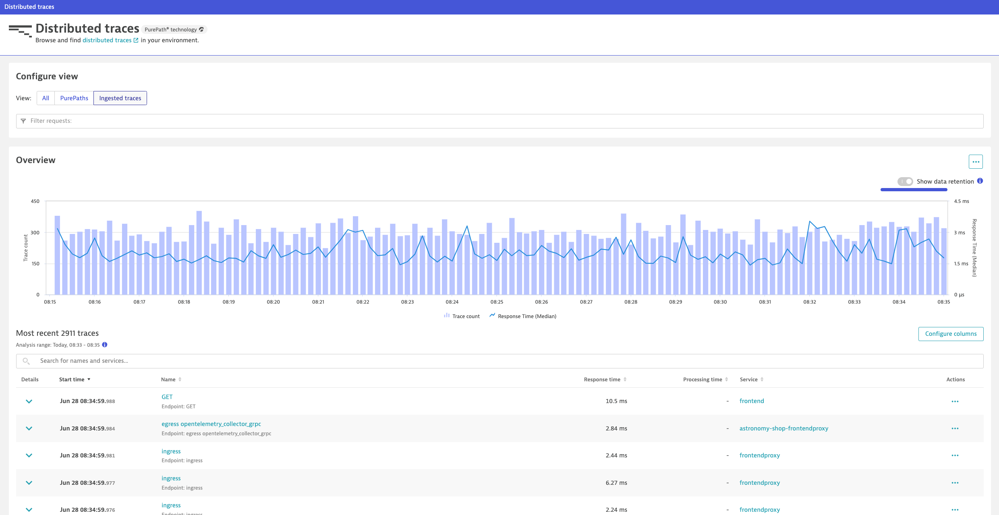

id: dt-k8s-otel-o11y-traces
summary: dynatrace otel trace ingest for kubernetes using opentelemetry collector
author: Tony Pope-Cruz

# Kubernetes OpenTelemetry Trace Ingest with Dynatrace
<!-- ------------------------ -->
## Overview 
Total Duration: 20

### What You’ll Learn Today
In this lab we'll utilize the OpenTelemetry Collector deployed as a Deployment (Gateway) to collect application traces/spans, generated by OpenTelemetry, from a Kubernetes cluster and ship them to Dynatrace.

Lab tasks:
1. Deploy OpenTelemetry Collector as a Deployment
2. Configure OpenTelemetry Collector service pipeline for span enrichment
3. Analyze application reliability via traces in Dynatrace


<!-- -------------------------->
## Technical Specification 
Duration: 2

#### Technologies Used
- [Dynatrace](https://www.dynatrace.com/trial)
- [Kind Kubernetes](https://kind.sigs.k8s.io/)
  - tested on Kind v0.24.0
- [OpenTelemetry Demo astronomy-shop](https://opentelemetry.io/docs/demo/)
  - tested on release 1.10.0, helm chart release 0.31.0
- [Istio](https://istio.io/latest/docs/)
  - tested on v1.22.1
- [OpenTelemetry Collector - Dynatrace Distro](https://docs.dynatrace.com/docs/extend-dynatrace/opentelemetry/collector/deployment)
  - tested on v0.8.0

#### Reference Architecture
TODO

#### Prerequisites

<!-- -------------------------->
## Setup
Duration: 18

### Launching Lab Guide Locally

Clone the repo:
```sh
git clone --single-branch --branch code-spaces https://github.com/dynatrace-wwse/enablement-kubernetes-opentelemetry/tree/main/lab-modules/dt-k8s-otel-o11y-traces.git
```

Move into the lab guide directory:
```sh
cd dt-k8s-otel-o11y-traces/lab-guide
```

Run the generator command:
```sh
node bin/generator.js
```

Run the server command:
```sh
node bin/server.js
```

Open the URL in your browser:
```text
http://localhost:3000
```

### Prerequisites

#### Codespaces Cluster Set Up
Create a new instance or use an existing instance of the `dt-k8s-otel-o11y-cluster` Codespaces.

[dt-k8s-otel-o11y-cluster](https://github.com/dynatrace-wwse/enablement-kubernetes-opentelemetry/tree/main/lab-modules/dt-k8s-otel-o11y-cluster/tree/code-spaces)

Navigate to the Github repository.  Click on `Code`.  Click on `Codespaces`.  Click on `New with options`.


Choose the Branch `code-spaces`.  Choose the Dev Container Configuration `Kubernetes in Codespaces`.

Choose a Region near your Dynatrace tenant.

Choose Machine Type `4-core`.


Allow the Codespace instance to fully initialize.  It is not ready yet.


The Codespace instance will run the post initialization scripts.


When the Codespace instance is idle, validate the `astronomy-shop` pods are running.

Command:
```sh
kubectl get pods -n astronomy-shop
```


#### Generate Dynatrace Access Token
Generate a new API access token with the following scopes:
```
Ingest events
Ingest logs
Ingest metrics
Ingest OpenTelemetry traces
```
[See Related Dynatrace API Token Creation Documentation](https://docs.dynatrace.com/docs/dynatrace-api/basics/dynatrace-api-authentication#create-token)


#### Import Dashboard into Dynatrace
[Dashboard](/dt-k8s-otel-o11y-traces_dt_dashboard.json)

#### Define workshop user variables
In your Github Codespaces Terminal:
```
DT_ENDPOINT=https://{your-environment-id}.live.dynatrace.com/api/v2/otlp
DT_API_TOKEN={your-api-token}
NAME=<INITIALS>-k8s-otel-o11y
```

#### Clone the `code-spaces` branch to your Codespaces instance
Command:
```sh
git clone --single-branch --branch code-spaces https://github.com/dynatrace-wwse/enablement-kubernetes-opentelemetry/tree/main/lab-modules/dt-k8s-otel-o11y-traces.git
```

#### Move into the base directory
Command:
```sh
cd dt-k8s-otel-o11y-traces
```

### OpenTelemetry Collector - Dynatrace Distro
https://docs.dynatrace.com/docs/extend-dynatrace/opentelemetry/collector/deployment

#### Create `dynatrace` namespace
Command:
```sh
kubectl create namespace dynatrace
```
Sample output:
> namespace/dynatrace created

#### Create `dynatrace-otelcol-dt-api-credentials` secret

The secret holds the API endpoint and API token that OpenTelemetry data will be sent to.

Command:
```sh
kubectl create secret generic dynatrace-otelcol-dt-api-credentials --from-literal=DT_ENDPOINT=$DT_ENDPOINT --from-literal=DT_API_TOKEN=$DT_API_TOKEN -n dynatrace
```
Sample output:
> secret/dynatrace-otelcol-dt-api-credentials created

#### Deploy `cert-manager`, pre-requisite for `opentelemetry-operator`
https://cert-manager.io/docs/installation/

Command:
```sh
kubectl apply -f opentelemetry/cert-manager.yaml
```
Sample output:
> namespace/cert-manager created\
> customresourcedefinition.apiextensions.k8s.io/certificaterequests.cert-manager.io created\
> customresourcedefinition.apiextensions.k8s.io/certificates.cert-manager.io created\
> ...\
> validatingwebhookconfiguration.admissionregistration.k8s.io/cert-manager-webhook created

Wait 30-60 seconds for cert-manager to finish initializing before continuing.

#### Deploy `opentelemetry-operator`

The OpenTelemetry Operator will deploy and manage the custom resource `OpenTelemetryCollector` deployed on the cluster.

Command:
```sh
kubectl apply -f https://github.com/open-telemetry/opentelemetry-operator/releases/download/v0.103.0/opentelemetry-operator.yaml
```
Sample output:
> namespace/opentelemetry-operator-system created\
> customresourcedefinition.apiextensions.k8s.io/instrumentations.opentelemetry.io created\
> customresourcedefinition.apiextensions.k8s.io/opampbridges.opentelemetry.io created\
> ...\
> validatingwebhookconfiguration.admissionregistration.k8s.io/opentelemetry-operator-validating-webhook-configuration configured

Wait 30-60 seconds for opentelemetry-operator-controller-manager to finish initializing before continuing.

Validate that the OpenTelemetry Operator components are running.

Command:
```sh
kubectl get pods -n opentelemetry-operator-system
```
Sample output:
| NAME                             | READY | STATUS  | RESTARTS | AGE |
|----------------------------------|-------|---------|----------|-----|
| opentelemetry-operator-controller-manager-5d746dbd64-rf9st   | 2/2   | Running | 0        | 1m  |

#### Deploy OpenTelemetry Collector - Dynatrace Distro - Deployment (Gateway)
https://docs.dynatrace.com/docs/extend-dynatrace/opentelemetry/collector/deployment#tabgroup--dynatrace-docs--gateway

Distributed traces and their spans, generated by OpenTelemetry agents and SDKs, are exported from their origin to an `otlp` receiver.  These traces/spans can be sent directly to Dynatrace, using the OTLP ingest API.  However, it is highly recommended to use the OpenTelemetry Collector to process, filter, and manipulate the data first.

##### `otlp` receiver
https://github.com/open-telemetry/opentelemetry-collector/tree/main/receiver/otlpreceiver

Adding the `otlp` receiver allows us to receive telemetry from otel exporters, such as agents and other collectors.
```yaml
config: |
    receivers:
      otlp:
        protocols:
          grpc:
            endpoint: 0.0.0.0:4317
          http:
            endpoint: 0.0.0.0:4318
    service:
      pipelines:
        traces:
          receivers: [otlp]
          processors: [batch]
          exporters: [otlphttp/dynatrace]
```

##### Deploy OpenTelemetry Collector

The gateway collector deployment pattern consists of applications (or other collectors) sending telemetry signals to a single OTLP endpoint provided by one or more collector instances running as a standalone service (for example, a deployment in Kubernetes), typically per cluster, per data center or per region.

```yaml
---
apiVersion: opentelemetry.io/v1alpha1
kind: OpenTelemetryCollector
metadata:
  name: dynatrace-traces
  namespace: dynatrace
spec:
  envFrom:
  - secretRef:
      name: dynatrace-otelcol-dt-api-credentials
  mode: "deployment"
  image: "ghcr.io/dynatrace/dynatrace-otel-collector/dynatrace-otel-collector:latest"
```
Command:
```sh
kubectl apply -f opentelemetry/collector/traces/otel-collector-traces-crd-01.yaml
```
Sample output:
> opentelemetrycollector.opentelemetry.io/dynatrace-traces created

##### Validate running pod(s)
Command:
```sh
kubectl get pods -n dynatrace
```
Sample output:
| NAME                                       | READY | STATUS  | RESTARTS | AGE |
|--------------------------------------------|-------|---------|----------|-----|
| dynatrace-traces-collector-559d5b9d77-ms24p | 1/1   | Running | 0        | 1m  |

### Export OpenTelemetry data from `astronomy-shop` to OpenTelemetry Collector - Dynatrace Distro

The `astronomy-shop` demo application has the OpenTelemetry agents and SDKs already instrumented.  These agents and SDKs are generating traces (logs and metrics too) that are being exported to a Collector running within the `astronomy-shop` namespace bundled into the application deployment.  We want these traces to be shipped to Dynatrace as well.

#### Customize astronomy-shop helm values

OpenTelemetry data created by agents and SDKs should include `service.name` and `service.namespace` attributes.  We will make the `service.namespace` unique to our deployment using our `NAME` environment variable declared earlier, using a `sed` command on the Helm chart's `values.yaml` file.

```yaml
default:
  # List of environment variables applied to all components
  env:
    - name: OTEL_SERVICE_NAME
      valueFrom:
        fieldRef:
          apiVersion: v1
          fieldPath: "metadata.labels['app.kubernetes.io/component']"
    - name: OTEL_COLLECTOR_NAME
      value: '{{ include "otel-demo.name" . }}-otelcol'
    - name: OTEL_EXPORTER_OTLP_METRICS_TEMPORALITY_PREFERENCE
      value: cumulative
    - name: OTEL_RESOURCE_ATTRIBUTES
      value: 'service.name=$(OTEL_SERVICE_NAME),service.namespace=NAME_TO_REPLACE,service.version={{ .Chart.AppVersion }}'
```
> service.namespace=NAME_TO_REPLACE\
> service.namespace=INITIALS-k8s-otel-o11y

Command:
```sh
sed -i "s,NAME_TO_REPLACE,$NAME," astronomy-shop/collector-values.yaml
```

### Update `astronomy-shop` OpenTelemetry Collector export endpoint via helm

Our `collector-values.yaml` contains new configurations for the application so that the `astronomy-shop` Collector includes exporters that ship to the Collectors deployed in the `dynatrace` namespace.

```yaml
exporters:
  # Dynatrace OTel Collectors
  otlphttp/dttraces:
    endpoint: http://dynatrace-traces-collector.dynatrace.svc.cluster.local:4318
  otlphttp/dtlogs:
    endpoint: http://dynatrace-logs-collector.dynatrace.svc.cluster.local:4318
  otlphttp/dtmetrics:
    endpoint: http://dynatrace-metrics-cluster-collector.dynatrace.svc.cluster.local:4318
```

Command:
```sh
helm upgrade astronomy-shop open-telemetry/opentelemetry-demo --values astronomy-shop/collector-values.yaml --namespace astronomy-shop --version "0.31.0"
```
Sample output:
> NAME: astronomy-shop\
> LAST DEPLOYED: Thu Jun 27 20:58:38 2024\
> NAMESPACE: astronomy-shop\
> STATUS: deployed\
> REVISION: 2

##### OpenTelemetry Traces in Dynatrace
Result:

Open the Distributed Traces Classic App to view the traces in Dynatrace (you can use the new Distributed Traces App if available as well).



Locate a trace from the `checkoutservice` service with a trace/request name of `oteldemo.CheckoutService/PlaceOrder`.  This is a nice end-to-end trace.


Click on a span to see the various attributes that are attached to the span.


These attributes are good, but we can add more to provide better Kubernetes context to these transactions.

[Refer to the Dynatrace documentation for more details](https://docs.dynatrace.com/docs/observe-and-explore/distributed-traces/analysis/get-started)

### Configure OpenTelemetry Collector Service Pipeline

#### Add Kubernetes Attributes with the `k8sattributes` Processor

The Kubernetes Attributes Processor automatically discovers Kubernetes pods, extracts their metadata, and adds the extracted metadata to spans, metrics, and logs as resource attributes.

The Kubernetes Attributes Processor is one of the most important components for a collector running in Kubernetes. Any collector receiving application data should use it. Because it adds Kubernetes context to your telemetry, the Kubernetes Attributes Processor lets you correlate your application’s traces, metrics, and logs signals with your Kubernetes telemetry, such as pod metrics and traces.

##### Create `clusterrole` with read access to Kubernetes objects

Since the processor uses the Kubernetes API, it needs the correct permission to work correctly. For most use cases, you should give the service account running the collector the following permissions via a ClusterRole.

```yaml
---
apiVersion: rbac.authorization.k8s.io/v1
kind: ClusterRole
metadata:
  name: otel-collector-k8s-clusterrole-traces
rules:
- apiGroups: [""]
  resources: ["pods", "namespaces", "nodes"]
  verbs: ["get", "watch", "list"]
- apiGroups: ["apps"]
  resources: ["replicasets"]
  verbs: ["get", "list", "watch"]
- apiGroups: ["extensions"]
  resources: ["replicasets"]
  verbs: ["get", "list", "watch"]
```
Command:
```sh
kubectl apply -f opentelemetry/rbac/otel-collector-k8s-clusterrole-traces.yaml
```
Sample output:
> clusterrole.rbac.authorization.k8s.io/otel-collector-k8s-clusterrole-traces created

##### Create `clusterrolebinding` for OpenTelemetry Collector service account
```yaml
---
apiVersion: rbac.authorization.k8s.io/v1
kind: ClusterRoleBinding
metadata:
  name: otel-collector-k8s-clusterrole-traces-crb
subjects:
- kind: ServiceAccount
  name: dynatrace-traces-collector
  namespace: dynatrace
roleRef:
  kind: ClusterRole
  name: otel-collector-k8s-clusterrole-traces
  apiGroup: rbac.authorization.k8s.io
```
Command:
```sh
kubectl apply -f opentelemetry/rbac/otel-collector-k8s-clusterrole-traces-crb.yaml
```
Sample output:
> clusterrolebinding.rbac.authorization.k8s.io/otel-collector-k8s-clusterrole-traces-crb created

##### Add `k8sattributes` processor
https://opentelemetry.io/docs/kubernetes/collector/components/#kubernetes-attributes-processor

The `k8sattributes` processor will query metadata from the cluster about the k8s objects.  The Collector will then marry this metadata to the telemetry.

```yaml
k8sattributes:
    auth_type: "serviceAccount"
    passthrough: false
        filter:
        node_from_env_var: KUBE_NODE_NAME
    extract:
        metadata:
            - k8s.namespace.name
            - k8s.deployment.name
            - k8s.daemonset.name
            - k8s.job.name
            - k8s.cronjob.name
            - k8s.replicaset.name
            - k8s.statefulset.name
            - k8s.pod.name
            - k8s.pod.uid
            - k8s.node.name
            - k8s.container.name
            - container.id
            - container.image.name
            - container.image.tag
        labels:
        - tag_name: app.label.component
            key: app.kubernetes.io/component
            from: pod
    pod_association:
        - sources:
            - from: resource_attribute
              name: k8s.pod.uid
        - sources:
            - from: resource_attribute
              name: k8s.pod.name
        - sources:
            - from: resource_attribute
              name: k8s.pod.ip
        - sources:
            - from: connection
```
Command:
```sh
kubectl apply -f opentelemetry/collector/traces/otel-collector-traces-crd-02.yaml
```
Sample output:
> opentelemetrycollector.opentelemetry.io/dynatrace-traces configured

##### Validate running pod(s)
Command:
```sh
kubectl get pods -n dynatrace
```
Sample output:
| NAME                                       | READY | STATUS  | RESTARTS | AGE |
|--------------------------------------------|-------|---------|----------|-----|
| dynatrace-traces-collector-559d5b9d77-xn84p | 1/1   | Running | 0        | 1m  |


##### OpenTelemetry Traces in Dynatrace with Kubernetes Attributes
Dynatrace utilizes the `service.name`, `k8s.workload.name` and `k8s.namespace.name` to generate the unified service.\
https://docs.dynatrace.com/docs/platform-modules/applications-and-microservices/services/service-detection-and-naming/service-types/unified-service#service-detection

Result:

With the additional Kubernetes attributes attached to the spans, Dynatrace will detect new unified services.


Locate a new trace from the new `checkoutservice` service with a trace/request name of `oteldemo.CheckoutService/PlaceOrder`.  Click on a span to see the new resource attributes that have been added to the span.


##### Add `resourcedetection` processor (gcp)
https://github.com/open-telemetry/opentelemetry-collector-contrib/blob/main/processor/resourcedetectionprocessor/README.md#gcp-metadata

The resource detection processor can be used to detect resource information from the host, in a format that conforms to the OpenTelemetry resource semantic conventions, and append or override the resource value in telemetry data with this information.  Detectors are available for AWS, Azure, GCP, and several other platforms; see the documentation for more details.

```yaml
processors:
  resourcedetection/gcp:
    detectors: [env, gcp]
    timeout: 2s
    override: false
```

**note:** for this lab, the Kind cluster does not have cloud metadata to collect.  These values will be spoofed for the purposes of this lab.
```yaml
resource/kind:
  attributes:
  - key: cloud.account.id
    value: dt-k8s-o11y-account
    action: insert
  - key: k8s.cluster.name
    value: dt-k8s-o11y-kind
    action: insert
```

Command:
```sh
kubectl apply -f opentelemetry/collector/traces/otel-collector-traces-crd-03.yaml
```
Sample output:
> opentelemetrycollector.opentelemetry.io/dynatrace-traces configured

##### Validate running pod(s)
Command:
```sh
kubectl get pods -n dynatrace
```
Sample output:
| NAME                                       | READY | STATUS  | RESTARTS | AGE |
|--------------------------------------------|-------|---------|----------|-----|
| dynatrace-traces-collector-559d5b9d77-rp21d | 1/1   | Running | 0        | 1m  |


##### OpenTelemetry Traces in Dynatrace with Cloud Attributes
Result:

Locate a new trace from the new `checkoutservice` service with a trace/request name of `oteldemo.CheckoutService/PlaceOrder`.  Click on a span to see the new resource attributes that have been added to the span.


** In a real world scenario, `cloud.account.id` may be considered sensitive data; blurred for this reason.

##### Add `resource` processor (attributes)
https://github.com/open-telemetry/opentelemetry-collector-contrib/tree/main/processor/resourceprocessor

The `resource` processor allows us to directly add, remove, or change resource attributes on the telemetry.  View the documentation for more details.

We will use this processor to make the follow changes to our telemetry:
* `k8s.pod.ip` values in our data are either the same or invalid; delete the useless attribute
* `telemetry.sdk.name` set to `opentelemetry` will allow us to easily identify captured through OpenTelemetry
* `dynatrace.otel.collector` is a non-standardized attribute that we made up to help us identify which Collector captured this data
* `dt.security_context` is a Dynatrace specific attribute that we use to manage user permissions to the telemetry
    * This could also be set using OpenPipeline, but this puts control of this attribute's value at the app/infra layer (optionally)

```yaml
processors:
    resource:
        attributes:
        - key: k8s.pod.ip
          action: delete
        - key: telemetry.sdk.name
          value: opentelemetry
          action: insert
        - key: dynatrace.otel.collector
          value: dynatrace-traces
          action: insert
        - key: dt.security_context
          from_attribute: k8s.cluster.name
          action: insert
```
Command:
```sh
kubectl apply -f opentelemetry/collector/traces/otel-collector-traces-crd-04.yaml
```
Sample output:
> opentelemetrycollector.opentelemetry.io/dynatrace-traces configured

##### Validate running pod(s)
Command:
```sh
kubectl get pods -n dynatrace
```
Sample output:
| NAME                                       | READY | STATUS  | RESTARTS | AGE |
|--------------------------------------------|-------|---------|----------|-----|
| dynatrace-traces-collector-559d5b9d77-ny98q | 1/1   | Running | 0        | 1m  |


##### OpenTelemetry Traces in Dynatrace with Custom Resource Attributes
Result:

Locate a new trace from the new `checkoutservice` service with a trace/request name of `oteldemo.CheckoutService/PlaceOrder`.  Click on a span to see the new resource attributes that have been added to the span.


### Dynatrace Dashboard with Unified Services from OpenTelemetry

Open the Dashboard that you imported to view the throughput, response time, and failure metrics for the `astronomy-shop` application services.


<!-- ------------------------ -->
## Demo The New Functionality
TODO

<!-- -------------------------->
## Wrap Up

### What You Learned Today 
By completing this lab, you've successfully deployed the OpenTelemetry Collector to collect traces, enrich span attributes for better context, and ship those traces/spans to Dynatrace for analysis.
- The OpenTelemetry Collector was deployed as a Deployment, behaving as a Gateway on the cluster
- The Dynatrace Distro of OpenTelemetry Collector includes supported modules needed to ship traces to Dynatrace
  - The `otlp` receiver receives traces (and other signals) from OpenTelemetry exporters via gRPC/HTTP
  - The `k8sattributes` processor enriches the spans with Kubernetes attributes
  - The `resourcedetection` processor enriches the spans with cloud and cluster (GCP/GKE) attributes
  - The `resource` processor enriches the spans with custom (resource) attributes
- Dynatrace allows you to perform powerful queries and analysis of the trace/span data

<!-- ------------------------ -->
### Supplemental Material
TODO
