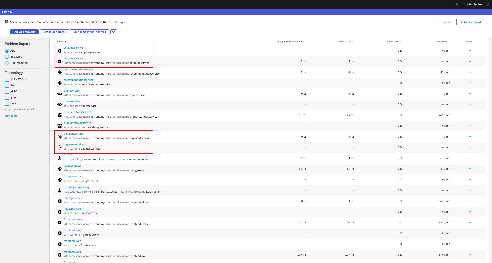

## k8sattributes Processor

### Add Kubernetes Attributes with the `k8sattributes` Processor

The Kubernetes Attributes Processor automatically discovers Kubernetes pods, extracts their metadata, and adds the extracted metadata to spans, metrics, and logs as resource attributes.

The Kubernetes Attributes Processor is one of the most important components for a collector running in Kubernetes. Any collector receiving application data should use it. Because it adds Kubernetes context to your telemetry, the Kubernetes Attributes Processor lets you correlate your application’s traces, metrics, and logs signals with your Kubernetes telemetry, such as pod metrics and traces.

### Create `clusterrole` with read access to Kubernetes objects

Since the processor uses the Kubernetes API, it needs the correct permission to work correctly. For most use cases, you should give the service account running the collector the following permissions via a ClusterRole.

```yaml
---
apiVersion: rbac.authorization.k8s.io/v1
kind: ClusterRole
metadata:
  name: otel-collector-k8s-clusterrole-traces
rules:
- apiGroups: [""]
  resources: ["pods", "namespaces", "nodes"]
  verbs: ["get", "watch", "list"]
- apiGroups: ["apps"]
  resources: ["replicasets"]
  verbs: ["get", "list", "watch"]
- apiGroups: ["extensions"]
  resources: ["replicasets"]
  verbs: ["get", "list", "watch"]
```
Command:
```sh
kubectl apply -f opentelemetry/rbac/otel-collector-k8s-clusterrole-traces.yaml
```
Sample output:
> clusterrole.rbac.authorization.k8s.io/otel-collector-k8s-clusterrole-traces created

### Create `clusterrolebinding` for OpenTelemetry Collector service account
```yaml
---
apiVersion: rbac.authorization.k8s.io/v1
kind: ClusterRoleBinding
metadata:
  name: otel-collector-k8s-clusterrole-traces-crb
subjects:
- kind: ServiceAccount
  name: dynatrace-traces-collector
  namespace: dynatrace
roleRef:
  kind: ClusterRole
  name: otel-collector-k8s-clusterrole-traces
  apiGroup: rbac.authorization.k8s.io
```
Command:
```sh
kubectl apply -f opentelemetry/rbac/otel-collector-k8s-clusterrole-traces-crb.yaml
```
Sample output:
> clusterrolebinding.rbac.authorization.k8s.io/otel-collector-k8s-clusterrole-traces-crb created

### Add `k8sattributes` processor
https://opentelemetry.io/docs/kubernetes/collector/components/#kubernetes-attributes-processor

The `k8sattributes` processor will query metadata from the cluster about the k8s objects.  The Collector will then marry this metadata to the telemetry.

```yaml
k8sattributes:
    auth_type: "serviceAccount"
    passthrough: false
        filter:
        node_from_env_var: KUBE_NODE_NAME
    extract:
        metadata:
            - k8s.namespace.name
            - k8s.deployment.name
            - k8s.daemonset.name
            - k8s.job.name
            - k8s.cronjob.name
            - k8s.replicaset.name
            - k8s.statefulset.name
            - k8s.pod.name
            - k8s.pod.uid
            - k8s.node.name
            - k8s.container.name
            - container.id
            - container.image.name
            - container.image.tag
        labels:
        - tag_name: app.label.component
            key: app.kubernetes.io/component
            from: pod
    pod_association:
        - sources:
            - from: resource_attribute
              name: k8s.pod.uid
        - sources:
            - from: resource_attribute
              name: k8s.pod.name
        - sources:
            - from: resource_attribute
              name: k8s.pod.ip
        - sources:
            - from: connection
```
Command:
```sh
kubectl apply -f opentelemetry/collector/traces/otel-collector-traces-crd-02.yaml
```
Sample output:
> opentelemetrycollector.opentelemetry.io/dynatrace-traces configured

### Validate running pod(s)
Command:
```sh
kubectl get pods -n dynatrace
```
Sample output:
| NAME                                       | READY | STATUS  | RESTARTS | AGE |
|--------------------------------------------|-------|---------|----------|-----|
| dynatrace-traces-collector-559d5b9d77-xn84p | 1/1   | Running | 0        | 1m  |


### OpenTelemetry Traces in Dynatrace with Kubernetes Attributes
Dynatrace utilizes the `service.name`, `k8s.workload.name` and `k8s.namespace.name` to generate the unified service.

https://docs.dynatrace.com/docs/platform-modules/applications-and-microservices/services/service-detection-and-naming/service-types/unified-service#service-detection

Result:

With the additional Kubernetes attributes attached to the spans, Dynatrace will detect new unified services.



Locate a new trace from the new `checkoutservice` service with a trace/request name of `oteldemo.CheckoutService/PlaceOrder`.  Click on a span to see the new resource attributes that have been added to the span.

