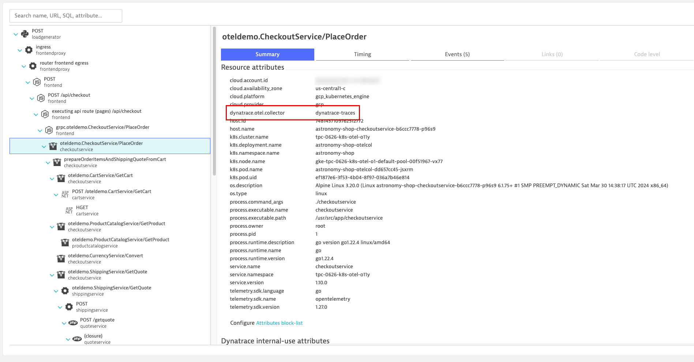

## resource Processor

### Add `resource` processor (attributes)
https://github.com/open-telemetry/opentelemetry-collector-contrib/tree/main/processor/resourceprocessor

The `resource` processor allows us to directly add, remove, or change resource attributes on the telemetry.  View the documentation for more details.

We will use this processor to make the follow changes to our telemetry:
* `k8s.pod.ip` values in our data are either the same or invalid; delete the useless attribute
* `telemetry.sdk.name` set to `opentelemetry` will allow us to easily identify captured through OpenTelemetry
* `dynatrace.otel.collector` is a non-standardized attribute that we made up to help us identify which Collector captured this data
* `dt.security_context` is a Dynatrace specific attribute that we use to manage user permissions to the telemetry
    * This could also be set using OpenPipeline, but this puts control of this attribute's value at the app/infra layer (optionally)

```yaml
processors:
    resource:
        attributes:
        - key: k8s.pod.ip
          action: delete
        - key: telemetry.sdk.name
          value: opentelemetry
          action: insert
        - key: dynatrace.otel.collector
          value: dynatrace-traces
          action: insert
        - key: dt.security_context
          from_attribute: k8s.cluster.name
          action: insert
```
Command:
```sh
kubectl apply -f opentelemetry/collector/traces/otel-collector-traces-crd-04.yaml
```
Sample output:
> opentelemetrycollector.opentelemetry.io/dynatrace-traces configured

### Validate running pod(s)
Command:
```sh
kubectl get pods -n dynatrace
```
Sample output:
| NAME                                       | READY | STATUS  | RESTARTS | AGE |
|--------------------------------------------|-------|---------|----------|-----|
| dynatrace-traces-collector-559d5b9d77-ny98q | 1/1   | Running | 0        | 1m  |


### OpenTelemetry Traces in Dynatrace with Custom Resource Attributes
Result:

Locate a new trace from the new `checkoutservice` service with a trace/request name of `oteldemo.CheckoutService/PlaceOrder`.  Click on a span to see the new resource attributes that have been added to the span.



### Dynatrace Dashboard with Unified Services from OpenTelemetry

Open the Dashboard that you imported to view the throughput, response time, and failure metrics for the `astronomy-shop` application services.


