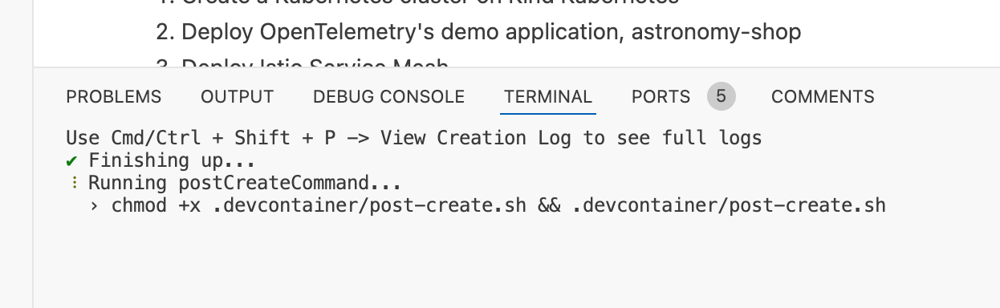

id: enablement-kubernetes-opentelemetry
summary: kubernetes observability with dynatrace and opentelemetry
author: Tony Pope-Cruz
# Enablement Kubernetes OpenTelemetry

## Codespaces Cluster Set Up
Create a new instance `enablement-kubernetes-opentelemetry` Codespaces.

Navigate to the Github repository.  Click on `Code`.  Click on `Codespaces`.  Click on `New with options`.


Choose the Branch `main`.  Choose the Dev Container Configuration `Kubernetes in Codespaces`.

Choose a Region near your Dynatrace tenant.

Choose Machine Type `4-core`.


Allow the Codespace instance to fully initialize.  It is not ready yet.


The Codespace instance will run the post initialization scripts.



When the Codespace instance is idle, validate the `astronomy-shop` pods are running.

Command:
```sh
kubectl get pods -n astronomy-shop
```

