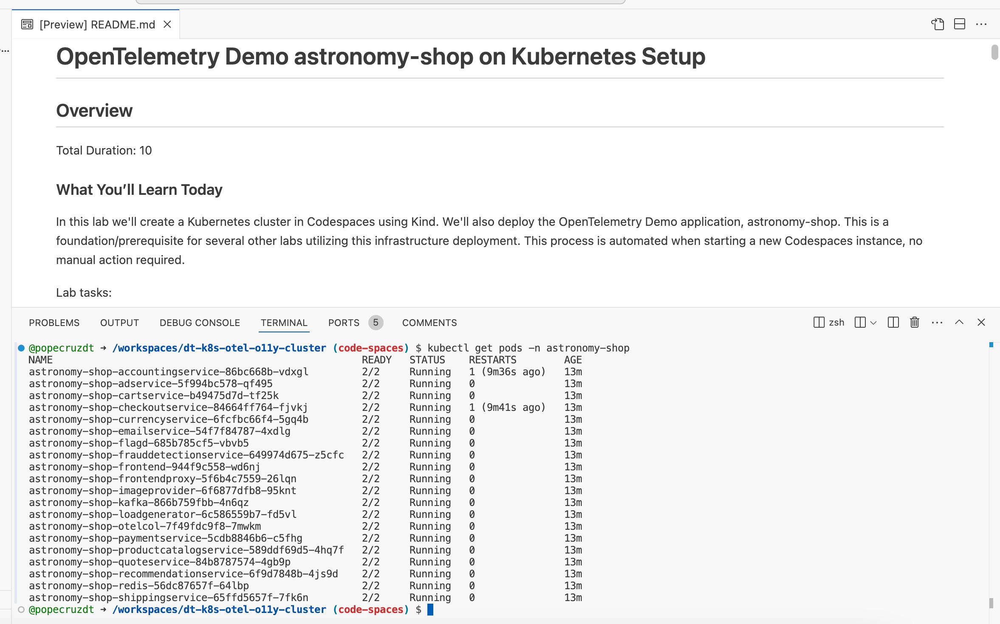
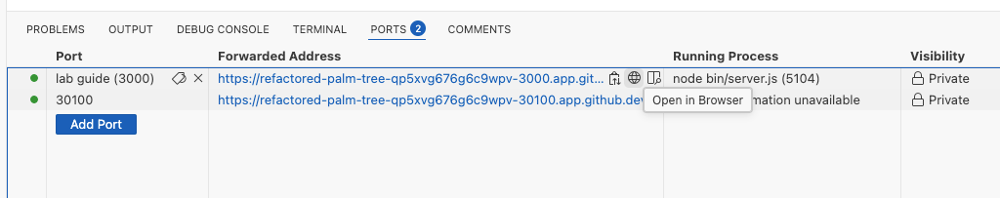
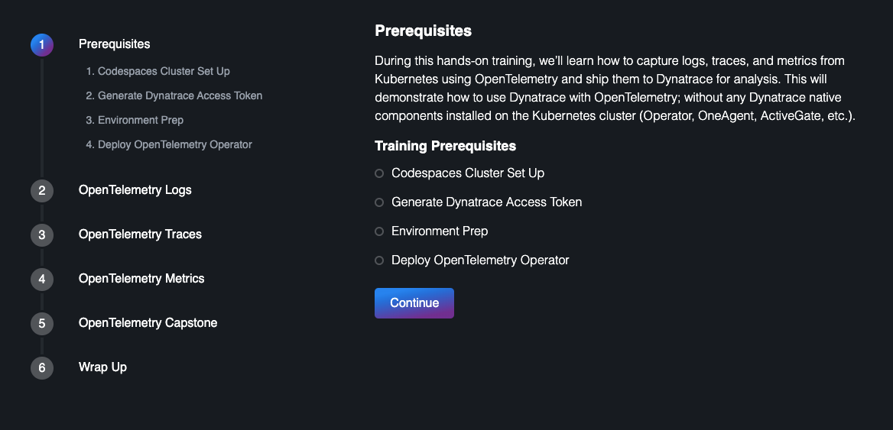

id: enablement-kubernetes-opentelemetry

summary: kubernetes observability with dynatrace and opentelemetry

author: Tony Pope-Cruz

# Enablement Kubernetes OpenTelemetry

During this hands-on training, we’ll learn how to capture logs, traces, and metrics from Kubernetes using OpenTelemetry and ship them to Dynatrace for analysis.  This will demonstrate how to use Dynatrace with OpenTelemetry; without any Dynatrace native components installed on the Kubernetes cluster (Operator, OneAgent, ActiveGate, etc.).

### Cloning repository

* Github Account
* git installed locally

### Launching Lab Guide Locally

Clone the repo:
```sh
git clone https://github.com/dynatrace-wwse/enablement-kubernetes-opentelemetry.git 
```

Install Node if not already installed:
[Download Node.js](https://nodejs.org/en/download/package-manager)

navigate to the repo
```sh
cd enablement-kubernetes-opentelemetry
```


### Codespaces Cluster Set Up

Create a new instance `enablement-kubernetes-opentelemetry` Codespaces.

Navigate to the Github repository.  Click on `Code`.  Click on `Codespaces`.  Click on `New with options`.


Choose the Branch `main`.  Choose the Dev Container Configuration `Kubernetes in Codespaces`.

Choose a Region near your Dynatrace tenant.

Choose Machine Type `4-core`.


Allow the Codespace instance to fully initialize.  It is not ready yet.


The Codespace instance will run the post initialization scripts.


When the Codespace instance is idle, validate the `astronomy-shop` pods are running.

Command:
```sh
kubectl get pods -n astronomy-shop
```



### Launching Lab Guide

Move into the lab-guide directory

Command:
```sh
cd lab-guide
```

Generate the lab guide content

Command:
```sh
node bin/generator.js
```

Launch the lab guide as a Node.js server. The following command will pipe out the std error and std output and send it to /dev/null in a separate thread and with nohup it is immune to hangups. 

Command:
```sh
nohup node bin/server.js > /dev/null 2>&1 &
```

THe lab guide will be available at http://localhost:3000/

Now, move back into the base directory

Command:
```sh
cd ..
```

Open the lab guide in your browser from the Codespaces instance exposed ports





Use the lab guide to move through the hands on exercises.

Once finished, if you want to bring the server back to the foreground type:
```sh
❯ jobs
[1]  + running    nohup node bin/server.js > /dev/null 2>&1
```

this will show the jobs running in the background listed with numbers. To bring it back type fg with the index number, like this:

```sh
fg %1
```

then cancel it with CTRL + C.

